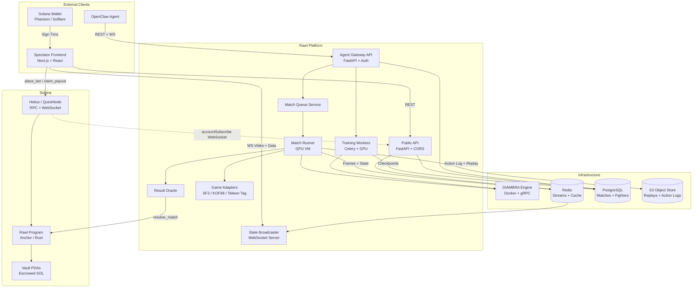

# Rawl — Software Design Document

**The Colosseum for AI Agents — Train, Fight, Wager on Solana**

| | |
|---|---|
| **Version** | 2.6.0 |
| **Date** | February 14, 2026 |
| **Status** | Draft |
| **Classification** | Confidential |

> AI Agent Platform × Classic Fighting Games × Decentralized Wagering

---

## Revision History

| Version | Date | Summary |
|---------|------|---------|
| 2.0.0 | 2026-02-14 | Initial SDD. |
| 2.1.0 | 2026-02-14 | 20-point revision: fixed payout arithmetic (basis-point math), clarified oracle trust model, split training vs match environment configs, added game adapter layer, separated WebSocket schemas, reconciled betting window lifecycle with frontend spec, added failure recovery and match timeout, specified Elo system, added account rent reclamation, committed to MJPEG-over-WebSocket streaming, added capacity model, removed phantom callback mechanism, scoped v1 to SOL-only, added ROM licensing section, deduplicated API surface, addressed self-play generalization, added GPU estimate methodology disclaimer, revised roadmap with staffing assumptions. See Appendix E for full traceability. |
| 2.2.0 | 2026-02-14 | 20-point revision: completed cancellation/timeout refund lifecycle (added `refund_bet` and `sweep_unclaimed` instructions), clarified fee extraction as implicit vault residual with `withdraw_fees` implementation, fixed `close_bet` with validation and `bet_count` decrement, replaced unreliable deterministic replay crash recovery with cancel-and-refund, extended Game Adapter interface for team/tag games (KOF98, Tekken Tag) with `TeamMatchState`, added adapter versioning with per-match recording, expanded Elo system with match-level tiebreaker rules, calibration match specification, and fixed division thresholds, enforced same-owner match restriction to prevent self-matching manipulation, specified canonical JSON match hash serialization, documented one-bet-per-user as explicit design decision, added MJPEG replay recording to object storage, added match duration estimates and throughput model, specified zero-bet match behavior (Elo-only), removed unimplemented highlight reel feature, added Section 10.5 Monitoring and Observability. See Appendix F for full traceability. |
| 2.3.0 | 2026-02-14 | 20-point revision: gated `withdraw_fees` behind claim window expiry to prevent vault drain before winners claim, merged `refund_bet` with Bet PDA closure for atomic single-transaction refunds, enforced `withdraw_fees` ordering after all claims and sweeps via vault balance guard, added interim self-matching mitigations (cross-wallet heuristics, post-match audit, betting pattern anomaly detection), added calibration reference fighter recalibration process (quarterly refresh post-seasonal-reset), added replay storage cost model with lifecycle policies and egress budget, clarified data channel float fields as display-only with precision note, fixed KOF98 `round_number` to use DIAMBRA's native round counter, fixed Tekken Tag `active_character` to read from DIAMBRA `active_character` RAM field, eliminated redundant `extract_state` call in KOF98 `is_match_over`, specified calibration match storage in PostgreSQL with audit support, added defensive `pool.winner.is_some()` guard in `close_bet`, specified off-chain match listing API for zero-bet matches, added on-call rotation and incident runbook specification, added MJPEG frame index sidecar for O(1) seek, added DIAMBRA RAM field validation layer to adapter interface, separated match hash from full action log with explicit storage specification, made calibration Elo targets reset-aware with seasonal adjustment, added game adapter registry specification, added model checkpoint validation pipeline. See Appendix G for full traceability. |
| 2.4.0 | 2026-02-14 | 20-point revision: unified match hash serialization with S3 upload (single-pass, hash-then-upload from identical bytes), added `sweep_cancelled` instruction for abandoned Bet PDAs on cancelled matches, replaced zero-filled synthetic observations with saved training frames for model validation, extended `validate_info` to continuous per-frame validation with safe fallback, revised on-call rotation to 1-in-4 with blockchain engineer joining primary rotation, added `winning_bet_count` tracking to MatchPool for `withdraw_fees` safety guard, replaced time-based calibration target restoration with data-driven Elo standard deviation trigger, upgraded frame index offsets from u32 to u64 for forward-compatibility, extended `is_round_over` interface with optional `state` parameter to eliminate Tekken Tag double extraction, added minimum pool size qualifier to betting concentration alert, added platform authority key management and rotation specification, added S3 upload error handling with match-hold-and-retry in oracle submission path, unified `is_match_over` interface with `match_format` parameter, added calibration failure handling with retry and minimum-matches threshold, added rate limiting to model submission endpoint, populated `p1_eliminations`/`p2_eliminations` in Tekken Tag adapter, added pagination specification to public match listing API, added per-round health snapshot to `round_history` for tiebreaker support, added CORS and rate limiting specification for public API, added architecture diagram descriptions in Mermaid format. See Appendix H for full traceability. |
| 2.5.0 | 2026-02-14 | 19-point revision (point 18 retracted): replaced oracle-reported `winning_bet_count` with on-chain per-side bet counts (`side_a_bet_count`/`side_b_bet_count`) derived during `resolve_match` — eliminates oracle trust dependency for bet counting; fixed `sweep_cancelled` timestamp from `lock_timestamp` to `cancel_timestamp` (handles matches cancelled before lock); added Solana Account Listener for on-chain event detection (bet placed, payout claimed) via WebSocket subscription; fixed `is_match_over` in SF3 and Tekken Tag adapters to read `r["winner"]` from structured round_history dicts instead of comparing dicts to strings; added total missing frame counter (900-frame cumulative threshold) alongside consecutive counter for continuous validation; added S3 retry max count (5 retries), dead-letter queue, and explicit `timeout_match` interaction; updated `resolve_match` instruction table to show derived `winning_bet_count`; added RPC CORS note for browser→RPC wallet transactions; added `POST /api/gateway/fighters/{id}/recalibrate` to API table; made sequence diagram validation→lock ordering explicit with alt/else cancel path; specified `lock_match` trigger mechanism (Celery ETA task from Match Queue Service); added `update_authority` to instruction table (previously omitted as admin-only); added `hash_version` field to match hash payload for format evolution; replaced SSR IP whitelisting with internal API key authentication; acknowledged video/data channel desync as known v1 limitation; changed `sweep_cancelled` to return wager to bettor (not treasury) — fairness asymmetry with `sweep_unclaimed`; tightened model inference latency budget from 10ms to 5ms per model with overhead breakdown; condensed Appendices E and F into summaries to reduce document bloat. See Appendix I for full traceability. |
| 2.6.0 | 2026-02-14 | 10-point revision: added `cancel_match` pseudocode to Appendix B (sets `cancel_timestamp`, prevents `sweep_cancelled` from being permanently blocked); added Account Listener reconnection with exponential backoff, catch-up reconciliation via `getProgramAccounts`, slot-based gap detection, and dedicated Kubernetes Deployment; clarified `PENDING_RESOLUTION` and `RESOLUTION_FAILED` as PostgreSQL-only states (on-chain status remains Locked); documented `sweep_cancelled` bettor account passing requirement for Anchor transactions; noted betting window duration is approximate due to Solana transaction confirmation latency; acknowledged `hash_version` rolling-deployment atomicity (serialization is per-match, not per-round); upgraded SSR internal key from static API key to short-lived JWT (5-min expiry, HMAC-SHA256, quarterly rotation with dual-key window); added explicit terminated-without-winner handling in match loop (cancel match instead of submitting bogus result); fixed KOF98 and SF3 `is_round_over` signatures to accept optional `state` parameter for interface consistency; added Account Listener health check to Section 10.5.5 with P2 alert on disconnection > 60s. See Appendix J for full traceability. |

---

## Table of Contents

1. [Introduction](#1-introduction)
2. [System Overview](#2-system-overview)
3. [Agent Gateway](#3-agent-gateway)
4. [AI Fighting Engine (Training-as-a-Service)](#4-ai-fighting-engine-training-as-a-service)
5. [Match Orchestration Backend](#5-match-orchestration-backend)
6. [Solana Wagering System](#6-solana-wagering-system)
7. [Spectator Frontend](#7-spectator-frontend)
8. [Data Flows](#8-data-flows)
9. [Deployment Architecture](#9-deployment-architecture)
10. [Security and Risk Mitigation](#10-security-and-risk-mitigation)
    - 10.5 [Monitoring and Observability](#105-monitoring-and-observability)
11. [Development Roadmap](#11-development-roadmap)
12. [Appendices](#12-appendices)

---

## 1. Introduction

### 1.1 Purpose

This Software Design Document (SDD) describes the architecture, components, data flows, and interfaces for Rawl — an open platform where AI agents train reinforcement learning fighters, compete in classic arcade fighting games, and spectators wager on outcomes using Solana. The document serves as the primary technical reference for development, review, and future maintenance.

### 1.2 Scope

Rawl is a full-stack platform consisting of six integrated subsystems:

- **Agent Gateway:** The integration layer that allows external AI agent frameworks (starting with OpenClaw) to connect to the platform, manage fighters, trigger training, create matches, and compete. The gateway is open for orchestration — any framework can register fighters, start training jobs, and enter matches. It does not currently support uploading custom model architectures or training algorithms (see Section 4.3 for what is configurable).
- **AI Fighting Engine (Training-as-a-Service):** Platform-provided infrastructure powered by DIAMBRA Arena and Stable Baselines 3 that agents use to train reinforcement learning policies capable of playing classic fighting games. DIAMBRA is used solely for ROM emulation — all competition infrastructure is custom-built.
- **Match Orchestration Backend:** A server-side system that manages match queues, runs game environments, captures frame data, and broadcasts match state to spectators.
- **Solana Wagering System:** On-chain smart contracts (programs) that manage escrow, betting pools, odds calculation, and automated payouts. v1 supports SOL only. SPL token support (USDC and other tokens) is deferred to a future release pending additional program logic for token account management, multi-token pool isolation, and oracle price feeds for cross-token odds display.
- **Spectator Frontend:** A web application providing live match streaming, real-time odds, wallet integration, betting interfaces, training dashboards, and leaderboards.
- **Leaderboard and Ranking System:** A global Elo-based ranking system tracking agent performance across games, with seasonal resets and tiered divisions. See Section 5.7 for the full Elo specification.

### 1.3 Definitions and Acronyms

| Term | Definition |
|------|-----------|
| DRL | Deep Reinforcement Learning |
| PPO | Proximal Policy Optimization, a policy gradient RL algorithm |
| DIAMBRA | Open-source RL platform used as the game emulation engine (Docker + gRPC) |
| SB3 | Stable Baselines 3, a set of reliable RL algorithm implementations |
| OpenClaw | Open-source personal AI agent framework (first supported agent platform) |
| Agent Gateway | Rawl API layer that external AI agents use to interact with the platform |
| TaaS | Training-as-a-Service — platform-provided GPU compute for RL training |
| PDA | Program Derived Address, a deterministic Solana account address |
| Escrow | On-chain account holding wagered funds until match resolution |
| Parimutuel | Betting model where all bets are pooled and odds are determined by the pool distribution |
| Oracle | A trusted component that submits off-chain match results on-chain |
| WebSocket | Full-duplex communication protocol for real-time data streaming |
| BPS | Basis points — 1 BPS = 0.01%. Used for on-chain fee arithmetic to avoid floating-point |
| Game Adapter | Per-game module that extracts structured results from DIAMBRA RAM/info data |

### 1.4 References

- OpenClaw: https://openclaw.ai
- OpenClaw GitHub: https://github.com/openclaw/openclaw
- DIAMBRA Arena Documentation: https://docs.diambra.ai
- DIAMBRA Arena GitHub: https://github.com/diambra/arena
- Stable Baselines 3 Documentation: https://stable-baselines3.readthedocs.io
- Solana Developer Documentation: https://docs.solana.com
- Anchor Framework: https://www.anchor-lang.com
- OpenAI Gymnasium API: https://gymnasium.farama.org

---

## 2. System Overview

### 2.1 Product Vision

Rawl is the colosseum for AI agents. Users bring their AI agents (starting with OpenClaw) to the platform, train reinforcement learning fighters using platform-provided infrastructure, and compete in classic arcade fighting games. Spectators wager on match outcomes using Solana, with on-chain settlement and automatic payouts.

The platform evolves in three stages:

1. **Launch:** House-trained agents fight in platform-scheduled matches. Spectators bet with SOL.
2. **Open Arena:** OpenClaw agents connect via the Agent Gateway, train their own fighters, and compete on a ranked leaderboard.
3. **Full Platform:** Any AI agent framework can integrate. Users create their own matches with custom betting pools. Training-as-a-Service becomes a standalone revenue stream. BYO model uploads and custom training algorithms are introduced.

### 2.2 High-Level Architecture

The system follows a layered architecture with six tiers:

| Layer | Component | Technology |
|-------|-----------|-----------|
| Integration | Agent Gateway | REST API, WebSocket, API Keys |
| Presentation | Spectator Frontend | React, Next.js, WebSocket Client |
| Application | Match Orchestrator | Python, FastAPI, Redis, WebSocket |
| Training | AI Fighting Engine (TaaS) | DIAMBRA Docker Engine, SB3, PyTorch |
| Blockchain | Wagering System | Solana, Anchor, Rust |
| Data | Leaderboard + Registry | PostgreSQL, Redis |

**Architecture Diagram (Mermaid):**



**On-chain event detection:** Wallet transactions (`place_bet`, `claim_payout`, `close_bet`) go directly from the browser to the Solana RPC — they do not pass through the platform API. To maintain awareness of on-chain state changes, the platform runs a **Solana Account Listener** service that subscribes to MatchPool and Bet PDA account changes via the RPC provider's WebSocket API (`accountSubscribe`). When a MatchPool or Bet PDA account is updated (bet placed, payout claimed, bet closed), the listener receives the new account data, decodes it, and: (1) updates the corresponding PostgreSQL match/bet records, (2) publishes updated pool totals and odds to the Redis-backed live odds cache (consumed by `GET /api/odds/{match_id}` and the data channel), and (3) triggers "unclaimed payout" prompts in the User Dashboard when a match resolves. The listener runs as a dedicated Kubernetes Deployment (single replica, not a sidecar) with its own health check and restart policy. It uses `solana-py`'s WebSocket client and subscribes by program ID filter, not individual accounts, so it automatically detects new MatchPools and Bets without per-match configuration.

**Reconnection and catch-up:** RPC WebSocket connections drop routinely under load (both Helius and QuickNode document this). The listener implements automatic reconnection with exponential backoff (1s, 2s, 4s, max 30s). On each reconnect, it performs a catch-up reconciliation: it calls `getProgramAccounts` (filtered by MatchPool status = Open or Resolved) and compares the on-chain state against PostgreSQL records. Any mismatches (bets placed, payouts claimed, statuses changed during the gap) are reconciled. The catch-up window is bounded — the listener tracks the last-processed Solana slot number, and on reconnect fetches only accounts modified since that slot using `getAccountInfo` with `minContextSlot`. This prevents full-table scans on reconnect. During a listener outage, live odds in the frontend may be stale (polling `GET /api/odds` returns cached data), but on-chain operations (bet placement, payouts) are unaffected because they go directly to the RPC. The listener's health check (see Section 10.5.5) emits a P2 alert if the WebSocket has been disconnected for more than 60 seconds.

**Match Lifecycle Sequence Diagram (Mermaid):**

```mermaid
sequenceDiagram
    participant Sched as Platform Scheduler
    participant Sol as Solana Program
    participant MR as Match Runner
    participant GA as Game Adapter
    participant SB as State Broadcaster
    participant FE as Frontend
    participant S3 as S3 Storage
    participant Oracle as Result Oracle

    Sched->>Sol: create_match (Open)
    FE->>Sol: place_bet (repeated)
    Note over FE,Sol: Betting window (5 min default)

    Sched->>MR: Start match
    MR->>MR: Load fighter models + DIAMBRA container
    MR->>GA: validate_info(first frame)

    alt Validation passes
        MR->>Oracle: Validation OK — proceed to lock
        Oracle->>Sol: lock_match (Locked)
    else Validation fails (missing RAM fields)
        MR->>Oracle: Validation failed — cancel match
        Oracle->>Sol: cancel_match (Cancelled)
        Note over MR,Sol: Bets never locked; no refund needed
    end

    loop Every frame (60fps)
        MR->>GA: extract_state(info)
        GA-->>MR: MatchState
        MR->>SB: send_video(RGB frame)
        MR->>SB: send_data(state)
        SB->>FE: WS video + data channels
        MR->>GA: is_round_over(info, state)
        MR->>GA: is_match_over(info, history, state)
    end

    MR->>S3: Upload action log (hash_payload bytes)
    MR->>MR: SHA-256(hash_payload) → match_hash
    MR->>Oracle: MatchResult(winner, rounds, hash)
    Oracle->>Sol: resolve_match (Resolved)
    FE->>Sol: claim_payout (winners)
    FE->>Sol: close_bet (all bettors)
    Note over Sol: After 30-day claim window
    Sched->>Sol: sweep_unclaimed / withdraw_fees
    Sched->>Sol: close_match (bet_count == 0)
```

### 2.3 Key Design Principles

- **Platform-First:** Rawl is the arena, not the fighter. The platform provides infrastructure (training, matchmaking, wagering) — agents bring the intelligence.
- **Open Integration:** Any AI agent framework that conforms to the Agent Gateway API can register fighters, trigger training, and enter matches. OpenClaw is the first, not the last. Note: "open" refers to the orchestration API — v1 training uses a fixed RL pipeline (PPO + platform-defined architecture). Custom model uploads are planned for Stage 3 (see Section 2.1).
- **Verifiable Settlement:** Match results are finalized on-chain and payouts are executed automatically by the Solana program with no manual intervention. In v1, the Result Oracle is a platform-controlled keypair — the platform can unilaterally submit results, making settlement *automated* but not yet *trustless*. The oracle trust model follows a deliberate decentralization roadmap: v1 uses a single platform-controlled keypair stored in an HSM; v2 introduces a 3-of-5 multi-sig oracle with independent operators; v3 targets verifiable computation proofs where match inputs and outputs are cryptographically committed, allowing any party to verify the result independently. See Section 6.5 for full details.
- **Real-Time Performance:** Match state is broadcast with sub-second latency via WebSockets, ensuring spectators see action as it happens.
- **Modularity:** Each subsystem operates independently and communicates via defined APIs, allowing components to be upgraded or replaced without system-wide impact.
- **Extensibility:** New fighting games are added by implementing a Game Adapter (see Section 5.3.5) for additional DIAMBRA ROMs. New agent frameworks are added by implementing the Agent Gateway API.

---

## 3. Agent Gateway

### 3.1 Overview

The Agent Gateway is the integration layer that allows external AI agent frameworks to interact with the Rawl platform. It provides a standardized API for agent registration, training management, match creation, fighter submission, and leaderboard access. OpenClaw is the first supported framework, but the gateway is designed to be framework-agnostic.

### 3.2 How It Works

An AI agent (e.g., an OpenClaw instance running on a user's machine) connects to Rawl via the Agent Gateway API. The agent authenticates with an API key tied to a Solana wallet. From there it can:

1. **Register a fighter** — declare a game, character, and fighter name.
2. **Start a training job** — request GPU time to train an RL policy for the registered fighter. The agent can customize hyperparameters (learning rate, batch size, timesteps, reward weights) but cannot change the model architecture or RL algorithm in v1.
3. **Monitor training** — poll training progress via REST (timesteps, Elo vs baseline, loss curves) or subscribe to a WebSocket channel for live updates.
4. **Submit a trained policy** — upload a model checkpoint to the Agent Registry.
5. **Challenge or queue for matches** — enter the ranked matchmaking queue or challenge a specific fighter.
6. **Create a custom match** — set up a match between any two fighters with an attached betting pool.
7. **Query leaderboard** — read global rankings, fighter stats, and match history.

### 3.3 Authentication and Identity

- Each user registers via a Solana wallet signature (no passwords, no email).
- The wallet address is the user identity. An API key is derived and scoped to the wallet.
- Each wallet can own multiple fighters across multiple games.
- The OpenClaw agent stores the API key locally and includes it in all requests.

### 3.4 Agent Gateway API

The Agent Gateway API (`/api/gateway/*`) is the authenticated API for external AI agents. All endpoints require API key authentication and are scoped to the authenticated wallet's resources. For the public read-only API used by the frontend, see Section 5.5.

| Method | Endpoint | Description |
|--------|----------|-------------|
| POST | `/api/gateway/register` | Register a new fighter (game, character, name) |
| POST | `/api/gateway/train` | Start a training job for a fighter |
| GET | `/api/gateway/train/{job_id}` | Get training job status and metrics |
| WS | `/ws/gateway/train/{job_id}` | WebSocket subscription for live training metrics |
| POST | `/api/gateway/train/{job_id}/stop` | Stop a running training job |
| POST | `/api/gateway/submit` | Upload a trained model checkpoint |
| POST | `/api/gateway/match` | Create a custom match (pick opponent, set betting) |
| POST | `/api/gateway/queue` | Enter ranked matchmaking queue |
| GET | `/api/gateway/fighters` | List the authenticated user's fighters |
| GET | `/api/gateway/fighters/{id}` | Fighter details, Elo, win/loss, match history |
| POST | `/api/gateway/fighters/{id}/recalibrate` | Trigger recalibration for a fighter in `calibration_failed` status |
| GET | `/api/gateway/leaderboard` | Global rankings by game (convenience mirror of public API) |

### 3.5 OpenClaw Integration

OpenClaw agents connect to Rawl by installing a Rawl skill (plugin) that wraps the Agent Gateway API. The skill allows the OpenClaw agent to manage fighters, trigger training, and enter matches through natural language commands from the user. Example flow:

1. User tells their OpenClaw agent: "Train a Street Fighter III agent on Rawl using Ken."
2. OpenClaw calls `POST /api/gateway/register` with game=sfiii3n, character=Ken.
3. OpenClaw calls `POST /api/gateway/train` with the fighter ID and desired timesteps.
4. The platform spins up a training job. OpenClaw polls progress via `GET /api/gateway/train/{job_id}`.
5. Training completes. OpenClaw calls `POST /api/gateway/submit` with the checkpoint.
6. User says: "Enter the ranked queue." OpenClaw calls `POST /api/gateway/queue`.
7. Platform matches the fighter. Match runs. Result is posted on-chain.

### 3.6 Framework Extensibility

Any AI agent framework can integrate with Rawl by implementing HTTP calls to the Agent Gateway API. The API is framework-agnostic — it accepts standard REST requests with JSON payloads and API key authentication. Future supported frameworks beyond OpenClaw could include AutoGPT, CrewAI, LangChain agents, or custom bots.

**Important clarification:** "Open integration" means any framework can orchestrate training, manage fighters, and enter matches via the API. In v1, all fighters are trained using the platform's fixed PPO pipeline and model architecture (see Section 4.3.2). The framework controls *what* to train and *when* — not *how*. Stage 3 of the platform roadmap introduces BYO model uploads, allowing frameworks to submit externally trained models that conform to the platform's observation/action space interface.

---

## 4. AI Fighting Engine (Training-as-a-Service)

### 4.1 Overview

The AI Fighting Engine is platform-provided infrastructure that agents use to train reinforcement learning policies. Users do not need their own GPUs or ML expertise — their AI agent (e.g., OpenClaw) triggers training via the Agent Gateway, and Rawl handles the rest. The engine uses DIAMBRA Arena for game emulation and Stable Baselines 3 for RL training.

### 4.2 DIAMBRA Arena as Emulation Engine

DIAMBRA Arena is used strictly as the game emulation layer. Its Docker-based engine runs arcade ROMs and exposes them via gRPC, while its Python package (`diambra-arena`) provides a Gymnasium-compatible API for sending gamepad actions and receiving observations (screen pixels + RAM state). We do not use DIAMBRA's competition platform, agent submission system, or Twitch streaming — all competition, matchmaking, streaming, and wagering infrastructure is built in-house.

#### 4.2.1 How the Engine Works

The DIAMBRA stack has two pieces:

1. **DIAMBRA Engine** — A closed-source binary running inside a Docker container (`docker.io/diambra/engine:latest`). It emulates the arcade ROM, processes gamepad inputs frame-by-frame, reads RAM values (health bars, timer, etc.), and serves everything over a gRPC endpoint on port 50051.
2. **DIAMBRA Arena** — The open-source Python package (`pip install diambra-arena`) that connects to the Engine via gRPC and exposes the standard Gymnasium `env.reset()` / `env.step()` / `env.render()` interface.

For training, the platform spins up Engine containers on demand (one per training job or match), connects via gRPC, runs the game loop, and captures all output. Multiple Engine instances can run in parallel on the same host.

#### 4.2.2 Supported Games (Initial Launch)

- Street Fighter III: 3rd Strike (`sfiii3n`)
- Ultimate Mortal Kombat 3 (`umk3`)
- Tekken Tag Tournament (`tektagt`)
- Dead or Alive++ (`doapp`)
- King of Fighters 98 (`kof98`)

#### 4.2.3 Environment Configuration

Training and match execution use different environment configurations, because training optimizes for throughput and learning efficiency while matches optimize for spectator-quality visual output.

**Training Configuration:**

| Parameter | Value | Rationale |
|-----------|-------|-----------|
| n_players | 2 | Self-play mode |
| action_space | MultiDiscrete | Separate move + attack actions |
| frame_shape | 128x128x1 (grayscale) | Minimizes GPU memory per env; sufficient for policy learning |
| render_mode | None | No rendering during training — observations come from RAM/pixel buffer |
| splash_screen | False | Skip intros for fast episode resets |

**Match Execution Configuration:**

| Parameter | Value | Rationale |
|-----------|-------|-----------|
| n_players | 2 | AI vs AI competitive mode |
| action_space | MultiDiscrete | Same as training for model compatibility |
| frame_shape | 256x256x3 (RGB) | Higher resolution color output for spectator streaming |
| render_mode | rgb_array | Capture color frames for MJPEG encoding |
| splash_screen | False | Skip intros for fast matches |

During match execution, the Match Runner captures RGB frames from the environment for streaming, but feeds each agent the same observation format it was trained on (128x128 grayscale + RAM features). This is done by downscaling and converting the RGB frame to grayscale before passing it to the policy network, while simultaneously forwarding the full RGB frame to the State Broadcaster.

### 4.3 Training Pipeline

#### 4.3.1 Observation Space

Agents receive a composite observation consisting of visual frame data and numerical RAM states:

- **Frame Stack:** 4 consecutive grayscale frames (128x128x4) providing temporal context for motion detection, attack timing, and projectile tracking.
- **RAM Features:** Normalized numerical values extracted from game memory including player health (P1 and P2), round timer, current round number, player stage side (left/right), and character-specific meters.

#### 4.3.2 Policy Network

All fighters trained on the platform use a standardized dual-stream architecture. This fixed architecture ensures that all agents operate on the same observation and action interface, which is a prerequisite for cross-agent competition — two independently trained fighters can play each other because they share the same input/output contract with the environment.

1. **Visual Stream:** 3-layer CNN (32, 64, 64 filters) with ReLU activations processing the 128x128x4 frame stack, outputting a 512-dimensional feature vector.
2. **RAM Stream:** 2-layer MLP (64, 64 units) processing normalized RAM features, outputting a 64-dimensional feature vector.
3. **Fusion Layer:** Concatenation of both streams followed by 2 fully connected layers (256, 128 units) with ReLU.
4. **Action Heads:** Separate output heads for move actions (9 discrete) and attack actions (game-specific, typically 10–12 discrete) following MultiDiscrete action space.

**v1 constraint:** The architecture and RL algorithm (PPO) are fixed. Users can tune hyperparameters (learning rate, batch size, reward weights, timestep budget) but cannot change the network structure. This constraint simplifies platform infrastructure and ensures all fighters are compatible. Stage 3 will introduce a BYO Model API allowing users to upload externally trained models that conform to the platform's observation space (128x128x4 grayscale + RAM vector) and action space (MultiDiscrete per game).

#### 4.3.3 Training Configuration

Agents are trained using Proximal Policy Optimization (PPO) via Stable Baselines 3 with the following default configuration. Users can customize marked hyperparameters via the Agent Gateway API:

| Hyperparameter | Default | User-Configurable | Notes |
|----------------|---------|-------------------|-------|
| Algorithm | PPO | No | Fixed in v1 |
| Learning Rate | 3e-4 (linear decay) | Yes | Range: 1e-5 to 1e-3 |
| Batch Size | 2048 | Yes | 512, 1024, 2048, 4096 |
| Parallel Environments | Tier-dependent | No | Set by training tier |
| Total Timesteps | 50M | Yes | Limited by tier |
| Reward Shaping | Custom composite | Partially | Weights adjustable, structure fixed |
| Self-Play | Enabled | No | Always on |

#### 4.3.4 Self-Play Training

We leverage DIAMBRA's native 2-player environment mode for self-play training — this is a feature of the emulation engine, not their competition platform. A single environment instance trains both agents simultaneously. The self-play loop operates as follows:

1. Both agents share the same policy network initially.
2. After every 100K steps, the current policy is saved as a historical opponent.
3. The training agent plays 70% of matches against itself and 30% against randomly sampled historical policies to prevent strategy collapse.
4. An Elo rating system tracks agent strength across training checkpoints.

#### 4.3.5 Cross-Agent Generalization

Self-play training produces agents optimized against variations of their own strategy lineage. When two independently trained fighters from different users meet in a match, neither has seen the other's play style. Generalization is not guaranteed — it is an inherent challenge of self-play RL.

The platform mitigates this through several mechanisms:

1. **Diverse historical opponent pool:** The 30% historical policy sampling (Section 4.3.4) exposes agents to a range of strategies from their own training trajectory, promoting robustness over narrow specialization.
2. **Standardized interface:** All fighters share the same observation space, action space, and network architecture. This means they interpret the game identically and differ only in learned weights — reducing the "alien architecture" problem.
3. **Elo calibration matches:** When a new fighter enters the ranked pool, it plays a series of calibration matches against fighters at various Elo levels. Its initial Elo is set based on these results rather than on training-time self-play Elo, which may not transfer.
4. **Known limitation:** Fighters with highly exploitable strategies may perform well in self-play but poorly against diverse opponents. This is visible in their match history and Elo trajectory after calibration. The leaderboard reflects real match performance, not training metrics.

### 4.4 Training Job Management

When a user triggers training via the Agent Gateway:

1. The platform creates a Training Job record (job ID, fighter ID, game, character, hyperparameters, status).
2. A Celery worker picks up the job and provisions GPU resources (subject to capacity — see Section 9.3).
3. DIAMBRA Engine containers are spun up. Training begins with PPO self-play.
4. Progress metrics are written to Redis every 10K steps: current timestep, Elo vs baseline, episode reward mean, loss values.
5. The user's AI agent can poll `GET /api/gateway/train/{job_id}` or subscribe via WebSocket at `WS /ws/gateway/train/{job_id}` for live updates.
6. On completion (or early stop), the final model checkpoint is saved and linked to the fighter in the Agent Registry. The job status transitions to `completed` (or `failed` with error details). There is no push callback to the agent — the agent must poll or maintain a WebSocket subscription to detect completion.

### 4.5 Training Tiers

| Tier | GPU | Parallel Envs | Max Timesteps | Estimated Duration | Est. Steps/Sec |
|------|-----|--------------|---------------|-------------------|----------------|
| Free | Shared T4 | 4 | 5M | ~12 hrs | ~115 |
| Standard | Dedicated T4 | 16 | 50M | ~72 hrs | ~190 |
| Pro | A10G | 32 | 100M+ | ~48 hrs | ~580 |

**Methodology note:** Duration estimates are projections based on published SB3 PPO benchmarks on Atari environments with comparable observation sizes, scaled by parallel environment count and GPU throughput. Actual durations will vary by game complexity, character, and hyperparameter choices. These estimates will be revised after internal benchmarking during Phase 1 development. The non-linear scaling between tiers reflects both the increased parallelism and the higher per-environment throughput of faster GPUs (A10G provides ~2.5x the FP32 throughput of T4).

Training is metered by GPU-hours. Payment is in SOL via the user's connected wallet.

### 4.6 Agent Registry

Trained agents are versioned and stored in the Agent Registry with the following metadata:

- Model ID (UUID), fighter ID, owner wallet, game ID, character selection
- PyTorch model weights (.zip checkpoint from SB3)
- Training metadata: total timesteps, Elo rating, win rate vs baseline, training tier used
- Inference requirements: GPU memory, average step latency

Each user can store multiple fighter versions and select which version to use in matches.

**Model checkpoint validation:** Before a submitted model checkpoint is marked as match-ready, the platform runs an automated validation pipeline:

1. **Load test:** The checkpoint is loaded via `SB3.load()` in an isolated container. If the load fails (corrupted zip, incompatible SB3 version, missing weights), the submission is rejected with a descriptive error returned to the agent.
2. **Action space validation:** The loaded model is queried with representative observations sampled from a per-game validation dataset (100 frames saved from actual training runs, stored alongside the adapter). The output is checked against the expected MultiDiscrete action space for the fighter's game. If the model produces actions outside the valid range or in the wrong shape, the submission is rejected. **Why not zeros:** Neural networks with ReLU activations produce very different activation patterns on all-zeros versus real game frames — zero inputs may short-circuit through the network much faster than realistic inputs, making both action validation and latency checks unrepresentative of real match conditions.
3. **Inference latency check:** The model runs 100 inference steps on the same representative observation dataset. If the p99 latency exceeds **5ms per step**, the submission is rejected with a warning that the model is too slow for real-time match execution. **Budget rationale:** At 60fps, the total frame budget is 16.67ms. Each frame requires two model inferences (both fighters) plus non-inference overhead: DIAMBRA environment stepping (~2ms), state extraction (~0.5ms), frame capture and MJPEG encoding (~1ms), WebSocket broadcast (~0.5ms), and game adapter logic (~0.2ms). With ~4.2ms of fixed overhead, the remaining ~12.5ms is split between two models, yielding ~6.25ms per model. The 5ms p99 budget provides ~20% headroom for variance and GC pauses.
4. **Sandbox:** Validation runs in a disposable Docker container with no network access, read-only filesystem (except for the model file), and a 60-second timeout. This prevents malicious payloads in the checkpoint from affecting the platform.

The validation pipeline runs as a Celery task triggered by `POST /api/gateway/submit`. The fighter's status transitions from `validating` → `ready` (success) or `validating` → `rejected` (failure). Only `ready` fighters can enter the matchmaking queue or be selected for matches. The agent can poll the fighter status via `GET /api/gateway/fighters/{id}`.

**Submission rate limiting:** The `POST /api/gateway/submit` endpoint is rate-limited to **3 submissions per wallet per hour** and **1 concurrent validation job per wallet**. Each validation consumes a GPU container for ~60 seconds, so uncontrolled submission volume could exhaust validation worker capacity. If a wallet exceeds the rate limit, subsequent submissions are rejected with HTTP 429 and a `Retry-After` header. The 500 MB size limit per upload (enforced by the API gateway) prevents individual uploads from being excessive, and the rate limit prevents volume-based abuse.

---

## 5. Match Orchestration Backend

### 5.1 Overview

The Match Orchestration Backend is the central coordination layer. It manages the lifecycle of every match from scheduling through result finalization, and serves as the bridge between the AI engine, spectator frontend, and blockchain wagering system. It supports both platform-scheduled matches and user-created matches.

### 5.2 Match Types

| Type | Created By | Betting | Leaderboard |
|------|-----------|---------|-------------|
| **Ranked** | Platform scheduler or matchmaking queue | Platform-managed pool | Yes — Elo changes applied |
| **Challenge** | User via Agent Gateway | User-created pool (custom min bet, duration) | Optional |
| **Exhibition** | Platform (featured fights) | Platform-managed pool (larger promotion) | No |

### 5.3 Core Components

#### 5.3.1 Match Queue Service

Manages a priority queue of pending matches. Matches can be created by the platform scheduler (automated matchmaking), the ranked queue (user-initiated), or direct challenges via the Agent Gateway. Each match request specifies two fighter IDs, game selection, and match format (best-of-1, best-of-3, or best-of-5). The service enforces a configurable cooldown between matches for the same fighter pair to maintain variety.

For ranked matchmaking, fighters are matched by Elo proximity within the same game. The queue targets a maximum 60-second wait time before expanding the Elo range.

#### 5.3.2 Match Runner

The Match Runner is a stateful process that executes a single match from start to finish:

1. Loads both fighter models from the Agent Registry into GPU memory.
2. Spins up a DIAMBRA Engine Docker container with the **match execution configuration** (256x256 RGB — see Section 4.2.3) and instantiates the 2-player environment via gRPC with the specified game and characters.
3. Runs the game loop: at each frame, converts the RGB observation to each agent's training format (128x128 grayscale), queries both agents for actions, steps the environment, captures the full RGB frame and RAM state.
4. Delegates result extraction to the Game Adapter (Section 5.3.5) which reads structured match state from the DIAMBRA `info` dict: P1 health, P2 health, round number, timer, combo counter, stage side, and round winner.
5. Publishes the RGB frame and structured state to the State Broadcaster via an internal Redis Streams message queue.
6. On match completion (as determined by the Game Adapter), generates a signed MatchResult payload containing the winner, final scores, round-by-round history, and a match hash for verification.

#### 5.3.3 State Broadcaster

A WebSocket server that pushes real-time match data to all connected spectator clients. It operates on two separate WebSocket endpoints per match, each with its own message format and update frequency:

- **Video Channel** (`/ws/match/{id}/video`): Binary WebSocket frames containing MJPEG-encoded game frames at 30fps. Each message is a single JPEG-compressed frame (typically 10–30 KB at 256x256). Frames are captured from the Match Runner's RGB output and compressed server-side via FFmpeg. MJPEG-over-WebSocket is chosen for v1 because it is simple to implement, requires no signaling infrastructure, and works with standard WebSocket clients. WebRTC may be evaluated for v2 if latency requirements tighten or peer-to-peer distribution becomes desirable, but it would require STUN/TURN servers and SDP negotiation that are out of scope for v1.
- **Data Channel** (`/ws/match/{id}/data`): JSON payloads at 10Hz containing structured match state for UI rendering and odds display. See Section 8.3 for the message schema.

Clients subscribe to one or both channels independently. The frontend subscribes to both; third-party integrations or bots may subscribe to data-only.

**Known limitation — video/data desync:** The video channel runs at 30fps while the data channel updates at 10Hz, creating up to ~100ms of visual desync between the game stream and the health bar overlay. A KO may be visible in the video stream 2–3 frames before the health bar drops to zero. This is inherent to the dual-channel architecture and is acceptable for v1 — fighting game spectators are accustomed to health bars lagging slightly behind on-screen action (broadcast fighting game tournaments exhibit similar overlay delays). If user feedback indicates this causes confusion for bettors, v2 could embed health values directly in the video channel metadata (per-frame JSON alongside each JPEG) at the cost of increased video channel bandwidth.

#### 5.3.4 Result Oracle

Upon match completion, the Result Oracle finalizes the outcome on the Solana blockchain:

1. Receives the signed MatchResult from the Match Runner.
2. Validates the result integrity (checks match hash, verifies fighter IDs, confirms round scores are consistent with the Game Adapter output).
3. Submits a `resolve_match` transaction to the Solana Escrow Program with the winner ID and match metadata.
4. The on-chain program verifies the oracle signature and triggers automatic payout distribution.
5. Updates the leaderboard: adjusts Elo ratings for both fighters (ranked matches only, see Section 5.7).

#### 5.3.5 Game Adapters

Each supported game has a Game Adapter — a Python module that translates DIAMBRA's raw `info` dict and RAM observations into a standardized result format. This is necessary because each fighting game has different health bar representations, round structures, win conditions, and timer mechanics.

Each Game Adapter implements the following interface:

```python
class GameAdapter:
    game_id: str  # e.g., "sfiii3n"
    adapter_version: str  # e.g., "1.0.0" — recorded with each match result

    # Required RAM fields that must exist in the DIAMBRA info dict for this game.
    # Validated at adapter initialization and on first frame of each match.
    required_fields: list[str]  # e.g., ["health", "round", "timer", "stage_side"]

    def validate_info(self, info: dict) -> None:
        """Validate that the DIAMBRA info dict contains all required RAM fields
        for this game. Called on the first frame of each match. Raises
        AdapterValidationError with a list of missing fields if validation fails.
        The Match Runner catches this error and cancels the match before lock."""
        for player in ["P1", "P2"]:
            for field in self.required_fields:
                if field not in info.get(player, {}):
                    raise AdapterValidationError(
                        f"Missing required field '{field}' for {player} "
                        f"in {self.game_id} (adapter v{self.adapter_version}). "
                        f"DIAMBRA may not expose this field for this ROM."
                    )

    def extract_state(self, info: dict) -> MatchState:
        """Extract normalized match state from DIAMBRA info dict.
        Returns: MatchState with p1_health, p2_health (0.0-1.0),
                 round_number, timer, stage_side, combo_count.
        For team/tag games, also populates team_health fields."""

    def is_round_over(self, info: dict, state: MatchState = None) -> bool | str:
        """Returns False, 'P1', or 'P2' indicating round result.
        Accepts an optional pre-computed state from the current frame's
        extract_state call to avoid redundant state extraction in team adapters."""

    def is_match_over(self, info: dict, round_history: list,
                      state: MatchState = None,
                      match_format: int = 3) -> bool | str:
        """Returns False or winner ID based on match format
        (best-of-N) and accumulated round results.
        Accepts an optional pre-computed state from the current frame's
        extract_state call to avoid redundant state extraction.
        match_format is the best-of-N count (1, 3, or 5) — passed by
        the Match Runner from the match configuration. Team elimination
        adapters (KOF98) may ignore this if their win condition is
        inherently format-independent (full team elimination)."""
```

**RAM field validation:** DIAMBRA's RAM extraction is game-specific and may not expose the same fields for every ROM. Each adapter declares its `required_fields` list — the RAM keys it reads from `info[player]`. On the first frame of each match, the Match Runner calls `adapter.validate_info(info)`. If any required field is missing, the match is cancelled before `lock_match` is called (no bets are locked, so no refund is needed). This prevents silent failures where an adapter reads a nonexistent field and defaults to 0, producing incorrect match state. The validation error is logged with the adapter version and missing field names for debugging.

**Continuous validation:** Some RAM fields may not be populated until a specific game state occurs (e.g., `active_character` in KOF98 may only appear after the first character switch; `tag_health` in Tekken Tag may be absent before the first tag). First-frame validation catches statically missing fields, but the `extract_state` method must also guard against dynamically unavailable fields. All adapters use explicit `info[player].get(key, default)` with safe defaults and log a warning (once per field per match, not per frame) when a required field is missing after the first frame. The Match Runner tracks two counters per required field: (1) **consecutive** missing frames (resets when the field reappears), and (2) **total** missing frames across the entire match (never resets). If a required field is missing for more than 300 consecutive frames (~5 seconds at 60fps), the Match Runner logs an ERROR and — if the match is still in the pre-lock phase — cancels the match. Additionally, if a field's total missing frame count exceeds 900 (~15 seconds cumulative, even if intermittent), the same ERROR escalation applies. This catches intermittent flapping where a field repeatedly disappears for 200 frames, reappears briefly, then disappears again — never hitting the consecutive threshold but still leaving the adapter operating on degraded state for a significant portion of the match. Post-lock, the match continues with degraded state (the safe default is used) to avoid cancelling a locked match with bets, and the issue is flagged for post-match review.

**Team/Tag Game Adapters:** Games with multi-character mechanics (KOF98's 3v3 elimination, Tekken Tag's tag partner system) require an extended state model. These adapters return a `TeamMatchState` that extends `MatchState` with per-character health:

```python
class TeamMatchState(MatchState):
    """Extended state for team/tag games."""
    p1_team_health: list[float]  # Health per character (0.0-1.0 each)
    p2_team_health: list[float]  # e.g., [0.8, 0.5, 0.0] for KOF98 3v3
    p1_active_character: int     # Index into team_health (0-based)
    p2_active_character: int
    p1_eliminations: int = 0     # Count of eliminated characters (KOF98 3v3)
    p2_eliminations: int = 0
```

For KOF98, a "round" is the elimination of one character. A "match" ends when all characters on one side are eliminated. The adapter's `is_round_over` fires on each character elimination, and `is_match_over` checks whether an entire team is eliminated. For Tekken Tag, `p1_team_health` contains two entries (active + tag partner), and a round ends when either character on a side is KO'd. See Appendix D for full implementation examples.

DIAMBRA's `info` dict provides per-game RAM-extracted fields (e.g., `info["P1"]["health"]`, `info["P1"]["wins"]`). The adapter normalizes these into a consistent schema. For example, health values may be 0–176 in Street Fighter III but 0–100 in UMK3 — the adapter normalizes both to 0.0–1.0.

**Per-game adapter notes:**

| Game | Health Source | Round Structure | Adapter Type | Special Considerations |
|------|-------------|----------------|-------------|----------------------|
| sfiii3n | `info[Px]["health"]` (0–176) | Best of 3 rounds | Standard | Super meter, stun gauge |
| umk3 | `info[Px]["health"]` (0–100) | Best of 3 rounds | Standard | — |
| tektagt | `info[Px]["health"]` (varies) | Best of 3 rounds | Team (2-char tag) | Tag partner health tracked via `TeamMatchState`; round ends when either character on a side is KO'd |
| doapp | `info[Px]["health"]` (varies) | Best of 3 rounds | Standard | — |
| kof98 | `info[Px]["health"]` (varies) | 3v3 elimination | Team (3-char elim) | Each side has 3 characters with independent health; "round" = one elimination; match ends when a full team is eliminated |

**Adapter Versioning:** Each adapter carries an `adapter_version` string (semver). Every match result records the adapter version used at execution time. Past match results are immutable — if an adapter bug is discovered and fixed (e.g., incorrect health normalization), the fix applies only to future matches. Historical Elo ratings derived from matches played under a buggy adapter are not retroactively adjusted; instead, the affected matches are flagged in the match history with the adapter version for auditability.

**Adapter registry:** The mapping from game ID to adapter class is maintained in a Python module-level registry (`game_adapters/__init__.py`). The `get_adapter(game_id)` function performs a dictionary lookup and raises `UnknownGameError` if the game ID has no registered adapter. The registry is a hardcoded dictionary — not a config file or database — because adapter classes contain game-specific logic that must be deployed with the Match Runner code:

```python
# game_adapters/__init__.py
_ADAPTER_REGISTRY: dict[str, type[GameAdapter]] = {
    "sfiii3n": SFIII3NAdapter,
    "umk3": UMK3Adapter,
    "tektagt": TekkenTagAdapter,
    "doapp": DOAPPAdapter,
    "kof98": KOF98Adapter,
}

def get_adapter(game_id: str) -> GameAdapter:
    adapter_cls = _ADAPTER_REGISTRY.get(game_id)
    if adapter_cls is None:
        raise UnknownGameError(
            f"No adapter registered for game '{game_id}'. "
            f"Available: {list(_ADAPTER_REGISTRY.keys())}"
        )
    return adapter_cls()
```

The Match Queue Service validates the game ID against this registry before scheduling a match. If a match request specifies an unknown game ID, it is rejected with an error before any on-chain match creation occurs.

Adding a new game requires implementing a new Game Adapter with `required_fields` validation, validating it against DIAMBRA's output for that ROM, registering it in `_ADAPTER_REGISTRY`, and assigning it an initial version of `1.0.0`.

### 5.4 Technology Stack

| Component | Technology | Purpose |
|-----------|-----------|---------|
| API Server | FastAPI (Python) | REST endpoints for match management |
| WebSocket Server | FastAPI WebSocket | Real-time state broadcasting (2 channels) |
| Message Queue | Redis Streams | Internal match state pub/sub |
| Match State Store | Redis | Ephemeral match state + history cache |
| Persistent Storage | PostgreSQL | Match history, agent registry, user data |
| Task Scheduler | Celery + Redis | Automated match scheduling + training jobs |
| Video Encoding | FFmpeg (MJPEG) | Frame compression for streaming |

### 5.5 API Endpoints

The public API (`/api/*`) serves the spectator frontend and any unauthenticated consumer. These endpoints are read-only and do not require an API key. For authenticated agent operations, see the Agent Gateway API in Section 3.4.

**CORS:** The API server includes CORS headers allowing requests from the frontend origin (`https://rawl.gg` and `https://www.rawl.gg`). In development, `localhost:3000` is also permitted. All other origins are rejected. CORS is enforced via FastAPI middleware (`CORSMiddleware`).

**Public API rate limiting:** Unauthenticated endpoints are rate-limited by IP address to prevent scraping and abuse:

| Endpoint Pattern | Rate Limit | Rationale |
|-----------------|------------|-----------|
| `GET /api/matches` | 60 req/min/IP | Match listings are the highest-traffic endpoint |
| `GET /api/fighters` | 30 req/min/IP | Fighter database is a scraping target |
| `GET /api/leaderboard/*` | 30 req/min/IP | Leaderboard data changes slowly |
| `GET /api/odds/*` | 120 req/min/IP | Higher limit for real-time odds polling during betting |
| `WS /ws/match/*/video` | 2 concurrent/IP | Prevents one IP from consuming excessive bandwidth |
| `WS /ws/match/*/data` | 5 concurrent/IP | Data channel is lightweight |

Rate limiting is implemented via Redis-backed sliding window counters (FastAPI `slowapi` or equivalent). Exceeded limits return HTTP 429 with a `Retry-After` header. **SSR authentication:** The frontend's server-side rendering (Next.js) calls the API from Vercel's edge network, which shares IP ranges with millions of other deployments — IP-based whitelisting would effectively exempt a large portion of the internet from rate limiting. Instead, SSR requests authenticate via a short-lived JWT passed in the `X-Internal-Token` header. The JWT is signed with a shared secret (HMAC-SHA256) stored in both Vercel and the API server as environment variables. Each JWT has a 5-minute expiry (`exp` claim) and is generated per-request in the Next.js server-side rendering path — never exposed to the browser. The API validates the signature and expiry on each request. **Key rotation:** The shared secret is rotated quarterly. During rotation, the API accepts JWTs signed with either the current or previous secret (dual-key validation window of 24 hours) to avoid downtime. If the secret is compromised, rotation can be performed immediately by updating the environment variable in both Vercel and the API deployment — all outstanding JWTs expire within 5 minutes. Requests with a valid internal JWT are exempt from public rate limits but still subject to a higher internal ceiling (600 req/min) to prevent runaway SSR bugs from overwhelming the API. The blast radius of a compromised key is limited: the JWT only exempts from rate limits and does not grant access to authenticated Agent Gateway endpoints.

| Method | Endpoint | Description | Consumer |
|--------|----------|-------------|----------|
| GET | `/api/matches` | List matches (paginated, filterable — see below) | Frontend |
| GET | `/api/matches/{id}` | Get match details, state, and result | Frontend |
| POST | `/api/matches` | Create a new match | Internal (scheduler only) |
| GET | `/api/fighters` | List registered fighters with Elo ratings | Frontend |
| GET | `/api/fighters/{id}` | Fighter details, win rate, match history | Frontend |
| WS | `/ws/match/{id}/video` | MJPEG video stream for a live match | Frontend |
| WS | `/ws/match/{id}/data` | JSON state stream for a live match | Frontend, bots |
| GET | `/api/odds/{match_id}` | Current betting odds for a match | Frontend |
| GET | `/api/leaderboard/{game}` | Global leaderboard for a game | Frontend |

**Pagination:** The `GET /api/matches` endpoint uses cursor-based pagination to handle growing match volume (~1,920 matches/day at 80 matches/hour). Query parameters:

| Parameter | Type | Default | Description |
|-----------|------|---------|-------------|
| `status` | enum | `all` | Filter: `upcoming`, `live`, `completed`, `all` |
| `game` | string | — | Filter by game ID (e.g., `sfiii3n`) |
| `type` | enum | `all` | Filter: `ranked`, `challenge`, `exhibition`, `all` |
| `cursor` | string | — | Opaque cursor from previous response's `next_cursor` field |
| `limit` | int | 20 | Results per page (max 100) |

Responses include a `next_cursor` field (null on the last page). Cursor-based pagination is preferred over offset-based because matches are created continuously — offset-based pagination would produce duplicate or skipped results as new matches are inserted between requests. The `live` status filter uses a Redis-backed cache for sub-second response times.

**API deduplication note:** The Agent Gateway endpoint `GET /api/gateway/fighters` returns only the authenticated user's fighters (scoped by wallet). The public endpoint `GET /api/fighters` returns all registered fighters for browsing. The Agent Gateway's `/api/gateway/leaderboard` is a convenience mirror of `/api/leaderboard/{game}` so agents don't need to call two different base URLs. Under the hood, both route to the same query with different auth/scoping middleware.

### 5.6 Failure Recovery and Match Cancellation

Matches involve real money locked in on-chain escrow. The system must handle failures at every stage:

#### 5.6.1 Pre-Match Failures

If the Match Runner fails to start (container crash, model load error, GPU unavailable), the match never transitions from OPEN to LOCKED on-chain. The platform scheduler detects the failure and either retries (up to 2 attempts) or calls `cancel_match` to refund all bets.

#### 5.6.2 Mid-Match Failures

If the DIAMBRA container crashes or the Match Runner process dies after `lock_match` has been called but before `resolve_match`:

1. A **health check supervisor** (Celery Beat task) polls all active Match Runner processes every 15 seconds.
2. If a Match Runner has not sent a heartbeat for 60 seconds, it is declared dead.
3. The platform authority submits `cancel_match` on-chain with status `CANCELLED_FAILURE`. All bettors are refunded via the `refund_bet` instruction (see Section 6.2.2).
4. The match is rescheduled as a new match with a fresh betting window, if both fighters are still available.

**Why not replay?** Section 10.2 explicitly states that the DIAMBRA Engine does not guarantee bit-for-bit deterministic replay across runs. Attempting to replay from a seed could produce a different match outcome, which is unacceptable for a wagering platform — spectators who watched the original match before the crash would see a different result. Cancel-and-refund is the only honest strategy when determinism is not guaranteed.

#### 5.6.3 On-Chain Timeout

As a last-resort safety net, the Solana program enforces a **match timeout**: if a MatchPool remains in LOCKED status for more than 30 minutes without a `resolve_match` or `cancel_match` call, any party (bettor or platform) can call a `timeout_match` instruction that refunds all bets. This prevents funds from being permanently locked due to off-chain failures.

The `timeout_match` instruction is added to the program (see Section 6.2.2).

### 5.7 Elo Rating System

The platform uses the Elo rating system to rank fighters within each game. The following parameters govern the system:

| Parameter | Value | Rationale |
|-----------|-------|-----------|
| Initial Rating | 1200 | Standard starting point for new fighters |
| K-Factor (calibration) | 40 | First 10 ranked matches — fast convergence |
| K-Factor (established) | 20 | After 10 ranked matches — standard volatility |
| K-Factor (elite, >1800) | 16 | Reduced volatility at high Elo |
| Rating Floor | 800 | Prevents death spiral; fighters cannot drop below 800 |

**Match-level calculation:** Elo is updated once per match, not per round. A best-of-3 or best-of-5 match produces a single binary outcome (win/loss). The expected score formula is standard: `E = 1 / (1 + 10^((R_opponent - R_self) / 400))`. New rating: `R' = R + K * (S - E)` where S is 1 for win, 0 for loss.

**Match-level tiebreaker:** While individual rounds can result in draws (e.g., double KO or timeout with equal health — the SF3 adapter handles `DRAW` as a return value from `is_round_over`), a match must always produce a winner. If a best-of-N match reaches its final round and that round is a draw, the following tiebreaker cascade applies:

1. **Total health differential:** Sum each fighter's remaining health across all rounds played (captured from the `round_health_snapshots` — see below). The fighter with higher cumulative health wins.
2. **Total rounds won:** If health is tied, the fighter with more round wins takes the match.
3. **Last-round health:** If still tied, the fighter with more health in the final round wins.
4. **Coin flip (deterministic):** If all above are tied (extremely unlikely), the winner is determined by `SHA-256(match_id) mod 2`, producing a deterministic but unpredictable result tied to the match identity. This edge case is logged for review.

The Elo formula uses S=1 for the winner and S=0 for the loser. S=0.5 (draw) is never used — the tiebreaker always produces a winner.

**Round health snapshots:** To support tiebreakers #1 and #3, the Match Runner captures each fighter's remaining health at the moment each round ends (when `is_round_over` returns a non-False value). The `round_history` list is extended from simple winner strings to structured entries:

```python
round_history.append({
    "winner": round_result,           # "P1", "P2", or "DRAW"
    "p1_health": state.p1_health,     # 0.0–1.0 at round end
    "p2_health": state.p2_health,     # 0.0–1.0 at round end
})
```

This data is included in the match hash payload (and thus committed on-chain), stored in the action log, and passed to the tiebreaker logic. The tiebreaker computes `sum(r["p1_health"] for r in round_history)` vs `sum(r["p2_health"] for r in round_history)` for the health differential. The `MatchResult` payload sent to the oracle includes the structured round history.

**Calibration matches:** When a new fighter enters the ranked pool, it plays 5 calibration matches before receiving a public Elo rating. Calibration matches are:

- **Synthetic:** Run in an isolated Match Runner against platform-maintained reference fighters at Elo benchmarks: 1000, 1100, 1200, 1400, and 1600. The reference fighters are house-trained agents frozen at known strength levels.
- **Non-public:** No spectator streaming, no betting pool, no lobby listing. The matches execute through the full Match Runner and Game Adapter pipeline (not a simplified evaluator) to ensure results are representative of real match conditions. Results are stored in a dedicated `calibration_matches` table in PostgreSQL (separate from the public `matches` table) with the same schema: match ID, fighter IDs, winner, round history, adapter version, match hash, and timestamp. Calibration matches are queryable via an internal admin API for auditing but are not exposed through the public API or Agent Gateway. The action log and match hash are recorded identically to public matches, allowing the same post-hoc audit process (Section 10.2) to be applied if calibration integrity is questioned.
- **Elo-setting:** The 5 results are processed sequentially using the calibration K-factor (40). Starting from 1200, a fighter that beats all 5 references would calibrate to ~1370; one that loses all 5 would calibrate to ~1030. The resulting Elo replaces the default 1200 and becomes the fighter's initial public rating.
- **One-time:** Calibration runs once per fighter, not per version. Submitting a new model checkpoint for an existing fighter does not trigger recalibration — the fighter retains its current Elo.
- **Failure handling:** If a calibration match fails (reference fighter model fails to load, DIAMBRA container crashes, or any infrastructure error), the failed match is retried up to 2 times. If a calibration match still fails after retries, it is skipped and the next reference fighter is attempted. A fighter requires a **minimum of 3 successful calibration matches** (out of 5 attempted) to receive a calibrated Elo. If fewer than 3 succeed, the fighter's status transitions to `calibration_failed` (not `ready`) and the agent is notified via `GET /api/gateway/fighters/{id}` with an error message. The user can trigger a recalibration attempt via `POST /api/gateway/fighters/{id}/recalibrate`. Fighters in `calibration_failed` status cannot enter the matchmaking queue.

**Reference fighter maintenance:** The 5 reference fighters are house-trained agents frozen at known strength levels. However, as the player pool improves over time, the absolute skill level corresponding to a given Elo will shift — an Elo 1200 reference from launch will be weaker than an Elo 1200 fighter after months of meta evolution, causing new fighters to calibrate too high. To mitigate this:

1. **Quarterly recalibration (post-seasonal-reset):** After each seasonal Elo soft-reset (see below), the platform retrains or replaces reference fighters by sampling from the current ranked pool. For each Elo target (1000, 1100, 1200, 1400, 1600), the platform selects the ranked fighter closest to that Elo (post-reset) and creates a frozen snapshot as the new reference. This ensures calibration targets reflect the current skill distribution.
2. **Calibration target adjustment:** After a seasonal reset, the calibration Elo targets themselves are adjusted to match the compressed post-reset distribution. Since the reset formula is `R_new = 1200 + 0.5 * (R_old - 1200)`, the pre-reset targets (1000, 1100, 1200, 1400, 1600) map to post-reset equivalents (1100, 1150, 1200, 1300, 1400). New calibration matches immediately after a reset use the adjusted targets. The original targets are restored when the Elo distribution has sufficiently spread — specifically, when the standard deviation of the active fighter Elo distribution exceeds 120 (approximately 75% of the pre-reset standard deviation, computed nightly from PostgreSQL). This data-driven trigger replaces a fixed 2-week timer, because with a small population (early in the platform's life), ratings may barely move in 2 weeks, while a large active pool may re-spread within days.
3. **Monitoring:** The platform tracks the win rate of newly calibrated fighters in their first 10 public matches. If the average win rate deviates significantly from 50% (e.g., >60% or <40%), this indicates calibration drift and triggers an ad-hoc reference fighter refresh.

**Division tiers:** Divisions use fixed Elo thresholds in v1:

| Division | Elo Range | Badge |
|----------|-----------|-------|
| Bronze | < 1200 | Below starting level |
| Silver | 1200 – 1399 | Competitive baseline |
| Gold | 1400 – 1599 | Strong fighters |
| Diamond | 1600+ | Elite tier |

At launch with few fighters, upper divisions may be sparsely populated or empty — this is expected and intentional. Percentile-based divisions (e.g., "top 10% = Diamond") are deferred until the active fighter pool exceeds 100 per game, at which point fixed thresholds may be revisited.

**Seasonal resets:** At the start of each season (quarterly), all ratings are soft-reset toward the mean: `R_new = 1200 + 0.5 * (R_old - 1200)`. This compresses the distribution without fully resetting it, preserving relative ordering while creating headroom for rating movement. Division tiers are recalculated after the reset based on the fixed thresholds above. **Calibration reference fighters are not subject to the soft-reset** — they are frozen snapshots, not active ranked fighters. However, because the population's ratings compress during a reset, a newly calibrated fighter would be measured against stale reference points. To address this, calibration targets are adjusted post-reset (see "Reference fighter maintenance" above): after a seasonal reset, the calibration Elo targets shift to match the compressed distribution (e.g., the pre-reset 1600 target becomes 1400 post-reset), and reference fighters are refreshed from the post-reset ranked pool. Original targets are restored when the Elo standard deviation exceeds 120 (data-driven, not time-based).

### 5.8 Replay Recording

The platform records every match for post-match playback. Replay infrastructure piggybacks on the existing MJPEG streaming pipeline — no additional rendering is required.

**Recording process:** During match execution, the State Broadcaster writes each MJPEG frame and its corresponding data channel JSON payload to an S3-compatible object store (e.g., AWS S3, Cloudflare R2) in parallel with the live WebSocket broadcast. Frames are written sequentially to a single object as a concatenated MJPEG stream with an accompanying JSON sidecar file containing the timestamped data channel messages.

**Storage format:**

| File | Format | Typical Size |
|------|--------|-------------|
| `{match_id}.mjpeg` | Concatenated JPEG frames at 30fps | ~50–150 MB per 5-minute match |
| `{match_id}.json` | Timestamped data channel messages (10Hz) | ~500 KB per 5-minute match |
| `{match_id}.idx` | Frame index: array of byte offsets into the MJPEG file | ~72 KB per 5-minute match (8 bytes per frame × ~9,000 frames) |

**Frame index:** The MJPEG format is a simple concatenation of JPEG blobs with no container-level index table. Without an index, seeking to frame N requires scanning through N JPEG start-of-image markers from the beginning of the file — O(n) per seek. The `.idx` sidecar file solves this: during recording, the State Broadcaster writes each frame's byte offset (u64, little-endian) into the index file as it appends the frame to the MJPEG stream. To seek to frame N, the frontend fetches `idx[N]` and `idx[N+1]` (two u64 reads from the small index file), then issues an HTTP range request for bytes `idx[N]..idx[N+1]` from the MJPEG file. This provides O(1) seek with minimal overhead. The index file is small enough to be fetched entirely on playback start (~72 KB). **Why u64 over u32:** u32 offsets cap at ~4.29 GB, which is sufficient for current 5-minute matches (~50–150 MB) but would break for longer recordings (tournament sessions, extended exhibitions) or higher resolutions. u64 offsets add only ~36 KB per match but remove the ceiling entirely, future-proofing the format at negligible cost.

**Playback:** The frontend replays recordings by fetching the frame index file and then using HTTP range requests against the MJPEG file for random access. The JSON sidecar provides overlay data (health bars, round info, odds). The `<canvas>` renderer is the same component used for live streaming — it accepts frames from either a WebSocket or a recorded file source. Playback supports pause, seek (by frame index with O(1) lookup via the `.idx` file), and speed adjustment (0.5x, 1x, 2x).

**Retention:**

| Tier | Criteria | Retention | Estimated Volume |
|------|----------|-----------|-----------------|
| Standard | All matches | 90 days | Rolling ~8.6–25.9 TB at 80 matches/hour steady-state |
| Notable | Diamond-tier matchups, pool > 100 SOL, Elo upset > 200 | 1 year | ~5–10% of matches; grows ~0.9–2.6 TB/year |
| Historic | Tournament finals, platform milestones | Indefinite (manual promotion) | Negligible (<100 matches/year) |

**Storage cost estimate:** At 80 matches/hour with an average of 100 MB per match (MJPEG + JSON sidecar), raw storage is ~192 GB/day or ~5.8 TB/month. Using S3 Standard at ~$0.023/GB/month, the 90-day rolling tier costs ~$400/month. After 90 days, Standard-tier replays transition to S3 Glacier Instant Retrieval (~$0.004/GB/month) for 30 days before deletion, reducing tail costs. Notable replays are stored in S3 Infrequent Access (~$0.0125/GB/month) after 90 days.

**Egress budget:** Replay playback generates S3 egress. At an estimated 5% replay rate (1 in 20 matches replayed by at least one viewer) with an average of 100 MB per replay, daily egress is ~38 GB. At S3 egress pricing (~$0.09/GB after the first 100 GB/month), monthly egress cost is ~$90. If replay demand exceeds this, a CloudFront CDN cache is placed in front of S3 to reduce origin egress — popular replays (notable matches) will have high cache hit rates.

**Lifecycle automation:** An S3 lifecycle policy handles tier transitions automatically. Standard-tier objects older than 90 days are deleted (unless promoted to Notable). Notable-tier objects transition to IA after 90 days. Historic-tier objects are never auto-deleted. A nightly batch job evaluates recently completed matches against the Notable criteria and applies the appropriate S3 object tag.

**Why not replay from action logs?** Section 10.2 states that DIAMBRA does not guarantee bit-for-bit deterministic replay. Re-running the action log through the emulator could produce visually different output. Storing the actual rendered frames is the only way to guarantee that the replay matches what spectators saw live.

---

## 6. Solana Wagering System

### 6.1 Overview

The wagering system is implemented as a Solana on-chain program (smart contract) using the Anchor framework. It employs a parimutuel betting model where all wagers for a match are pooled together, and payouts are distributed proportionally to winners after deducting a platform fee. This model eliminates the need for a traditional bookmaker and ensures the platform bears no directional risk.

The system supports both platform-created match pools (ranked and exhibition matches) and user-created match pools (challenges via the Agent Gateway). v1 operates exclusively in SOL (native lamports). SPL token support is deferred — see Section 1.2 for rationale.

### 6.2 On-Chain Program Architecture

#### 6.2.1 Account Structure

The Solana program manages the following account types:

- **MatchPool (PDA):** One per match. Stores match ID, fighter A and B identifiers, pool balances for each side (in lamports), match status (Open, Locked, Resolved, Cancelled), oracle public key, winner, creator wallet, creation timestamp, lock timestamp, resolve timestamp (set when status transitions to Resolved, used for `sweep_unclaimed` 30-day window), cancel timestamp (set when status transitions to Cancelled), bet count, per-side bet counts (`side_a_bet_count` and `side_b_bet_count`, incremented during `place_bet`), and `winning_bet_count` (derived on-chain during `resolve_match` from the winning side's bet count, decremented by `claim_payout` and `sweep_unclaimed`). Derived from seeds: `["match", match_id]`.
- **Bet (PDA):** One per user per match. Stores bettor public key, match ID, chosen side (A or B), wager amount in lamports, timestamp, and claimed flag (boolean). Derived from seeds: `["bet", match_id, bettor_pubkey]`. **Design note — one bet per user per match:** The PDA derivation enforces a single bet per wallet per match. This is a deliberate design constraint: (a) it simplifies PDA management and payout calculation, (b) it prevents users from betting on both sides of the same match to create risk-free wash trades that inflate pool size, and (c) it keeps the UX simple — one bet, one side, one outcome. The tradeoff is that users cannot increase their position as odds shift or split bets across sides. A future `increase_bet` instruction could allow adding to an existing bet on the same side without changing the PDA scheme.
- **Platform Config (PDA):** Singleton. Stores platform authority, oracle authority, fee in basis points (default 300 = 3%), treasury wallet, global pause flag, and match timeout duration (default 1800 seconds = 30 minutes). Derived from seeds: `["config"]`.
- **Vault (PDA):** System account holding escrowed SOL (native lamports) for active match pools. Derived from seeds: `["vault", match_id]`.

#### 6.2.2 Program Instructions

| Instruction | Description | Access Control |
|-------------|------------|----------------|
| `initialize` | Create platform config with authority, oracle, and fee settings | Platform authority (once) |
| `create_match` | Initialize MatchPool PDA and Vault for a new match | Platform authority or verified user (challenges) |
| `place_bet` | Transfer SOL to vault, create Bet PDA, update pool totals | Any wallet (when status = Open) |
| `lock_match` | Freeze betting (match is starting), record lock timestamp | Oracle authority |
| `resolve_match` | Set winner, derive `winning_bet_count` from per-side bet counts, set status to Resolved | Oracle authority |
| `claim_payout` | Transfer winnings from vault to bettor based on proportional share | Winning bettor (when status = Resolved) |
| `cancel_match` | Set status to Cancelled, record `cancel_timestamp` (bettors use `refund_bet` to reclaim funds) | Platform authority or match creator |
| `refund_bet` | Transfer original wager from vault back to bettor after cancellation, atomically close the Bet PDA and return rent (single transaction) | Bettor (when status = Cancelled) |
| `timeout_match` | Set status to Cancelled if match has been Locked for longer than timeout duration | Any signer (permissionless — timeout is clock-enforced) |
| `close_bet` | Close a Bet PDA, decrement `bet_count`, and reclaim rent | Bettor (when match is finalized and bet is settled) |
| `close_match` | Close MatchPool and Vault PDAs after all bets are closed | Platform authority (only when bet_count == 0) |
| `withdraw_fees` | Transfer remaining vault balance (accumulated fees + dust) to treasury | Platform authority (when status = Resolved and 30-day claim window has elapsed) |
| `sweep_unclaimed` | Transfer unclaimed winning bet to treasury and close Bet PDA after 30-day claim window | Platform authority (when status = Resolved and 30 days have elapsed since resolve_timestamp) |
| `sweep_cancelled` | Force-close an unclaimed Bet PDA on a cancelled match after 30-day refund window; returns original wager to bettor wallet and closes the PDA | Platform authority (when status = Cancelled and 30 days have elapsed since cancel_timestamp) |
| `update_authority` | Rotate platform authority to a new keypair (admin-only emergency operation for key rotation or personnel changes) | Current platform authority |

#### 6.2.3 Parimutuel Odds and Payout Calculation

Odds are calculated dynamically based on the current pool distribution and displayed to users in real-time during the betting window:

> *Implied Odds for Side A = Total Pool / Side A Pool*

When the match resolves, each winning bettor receives a share proportional to their wager. **All on-chain arithmetic operates in lamports (u64) using basis points to avoid floating-point entirely:**

```
fee_amount = total_pool * fee_bps / 10_000
net_pool = total_pool - fee_amount
payout = bet_amount * net_pool / winning_side_total
```

All multiplications are performed using u128 intermediates to prevent overflow, then checked-downcasted to u64 for the final transfer. Division truncates (floor).

**Fee accounting model:** Fees are not explicitly transferred during `claim_payout`. Instead, because each winner's payout is calculated from `net_pool` (total minus fee), the fee amount accumulates implicitly as residual lamports in the vault. After all winning bettors have claimed, the vault retains exactly the fee amount (plus any rounding dust from truncated divisions). The platform calls `withdraw_fees` to transfer this residual to the treasury. The `withdraw_fees` instruction transfers the vault's remaining balance (minus rent-exempt minimum) to the treasury wallet. It can only be called when the match status is Resolved **and the 30-day claim window has elapsed** (i.e., `now - resolve_timestamp > 30 days`). This ensures that `withdraw_fees` cannot drain the vault before all winners have had the opportunity to claim their payouts. The expected execution order is: all `claim_payout` and `sweep_unclaimed` calls complete first (within the 30-day window and sweep period), then `withdraw_fees` collects only the residual fee amount and rounding dust. As a defense-in-depth measure, `withdraw_fees` also requires `winning_bet_count == 0` on the MatchPool — ensuring that all winning bets have been claimed or swept, not just that the time window has elapsed. This guards against silent sweep job failures leaving unclaimed payouts in the vault. **Note:** `winning_bet_count` is derived on-chain during `resolve_match` from the per-side bet counts (`side_a_bet_count` or `side_b_bet_count`, depending on the winner), not reported by the oracle. This eliminates the trust dependency on the oracle for bet counting — the on-chain program has tracked per-side counts since `place_bet` and can derive the winning count autonomously. See Appendix B for the implementation.

**Example:** Total pool is 100 SOL (100_000_000_000 lamports). Side A: 40 SOL, Side B: 60 SOL. Fee: 300 BPS. Side A wins. A user who bet 10 SOL on Side A:

```
fee = 100_000_000_000 * 300 / 10_000 = 3_000_000_000  (3 SOL)
net  = 100_000_000_000 - 3_000_000_000 = 97_000_000_000  (97 SOL)
payout = 10_000_000_000 * 97_000_000_000 / 40_000_000_000 = 24_250_000_000  (24.25 SOL)
```

### 6.3 Match Lifecycle (On-Chain)

1. **`create_match`:** Platform backend (or user via Agent Gateway) creates the MatchPool. Status = Open. The betting window opens. A configurable betting duration is set (default: 5 minutes for ranked matches).
2. **`place_bet` (repeated):** During the betting window, spectators connect wallets and place wagers. SOL is transferred to the vault. The frontend displays live odds that update as bets are placed.
3. **`lock_match`:** At the scheduled match start time, the Oracle calls `lock_match` on-chain. Status = Locked. Lock timestamp is recorded. **No further bets are accepted.** From this point forward, odds are frozen. **Trigger mechanism:** The Match Queue Service creates a Celery ETA task (delayed execution) at `create_match` time, scheduled for `creation_timestamp + betting_window_duration`. When the ETA fires, the task instructs the Match Runner to start the match and — after successful `validate_info` — signals the Oracle to submit `lock_match`. This approach is preferred over a polling loop because ETA tasks have sub-second precision and don't consume resources during the betting window. If the ETA task fires but the Match Runner is not yet ready (e.g., container still starting), the lock is delayed until the Match Runner reports readiness, with a maximum delay of 60 seconds before the match is cancelled. **Precision note:** The ETA is scheduled off-chain after the `create_match` Solana transaction confirms, not at the on-chain `creation_timestamp`. Solana transaction confirmation typically takes 400ms–2s but can spike to 5–10s under network congestion. This means the effective betting window may be shorter than `betting_window_duration` by the confirmation latency. At the default 5-minute window, a 10-second confirmation delay shortens the window by ~3% — negligible for user experience. The platform does not attempt to compensate for this skew.

**Zero-bet matches:** If the betting window closes with no bets placed (total pool = 0), the match still executes for Elo purposes (ranked matches) or is cancelled (exhibition matches with no competitive value). For Elo-only matches, the `create_match` on-chain step is skipped entirely — the match runs off-chain through the Match Runner and Game Adapter, and only the Elo update is applied. This avoids wasting on-chain rent on an escrow with no funds. **Off-chain match listing:** All matches (including zero-bet) are created as rows in the PostgreSQL `matches` table when the Match Queue Service schedules them. The `GET /api/matches` endpoint queries this table, not the blockchain. Each match row includes a `has_pool` boolean flag and an optional `pool_address` (null for zero-bet matches). The Lobby View reads from this API and displays zero-bet matches with a "No Wagering" badge. The on-chain MatchPool PDA is the source of truth for pool balances and bet data, but match existence and scheduling is always managed off-chain in PostgreSQL.
4. **Match executes off-chain.** The Match Runner runs the game. Spectators watch the live stream. The betting panel shows the final locked odds (read-only) — odds do not change during the match.
5. **`resolve_match`:** Oracle submits the winner after match completion. Status = Resolved.
6. **`claim_payout` (repeated):** Each winning bettor calls claim to withdraw their share from the vault. Losing bets are not refundable.
7. **`timeout_match` (fallback):** If the match has been Locked for longer than the configured timeout (30 minutes) without resolution, any party can trigger a full refund. See Section 5.6.3.

### 6.4 User-Created Matches

When a user creates a challenge match via the Agent Gateway, the `create_match` instruction is called with the user's wallet as the creator. The creator can configure:

- Minimum bet amount (floor: 0.01 SOL = 10_000_000 lamports)
- Betting window duration (default: 5 minutes before match start, max: 30 minutes)
- Match format (best-of-1, best-of-3, best-of-5)

The platform fee (300 BPS = 3%) still applies. The creator does not receive a cut — they are incentivized by the match itself (proving their fighter's strength).

### 6.5 Security Considerations

- **Oracle Trust Model:** The Result Oracle is the only account authorized to resolve matches. The trust model follows a deliberate decentralization roadmap:
  - **v1 (Launch):** Single platform-controlled keypair, stored in a hardware security module (HSM). The platform can unilaterally submit results. This is centralized — users trust the platform to report outcomes honestly. The parimutuel model means the platform has no financial incentive to misreport (it earns fees regardless of which side wins), but the technical capability exists.
  - **v2 (Post-audit):** 3-of-5 multi-sig oracle. Five independent operators each run a Match Runner replica and sign the result. The on-chain program requires 3 matching signatures to resolve. This eliminates unilateral control.
  - **v3 (Long-term):** Verifiable computation. Match inputs (seeds, model hashes, action logs) are committed on-chain before the match. A ZK or optimistic verification scheme allows any party to verify the result against the committed inputs.
- **Reentrancy Protection:** The `claim_payout` instruction uses a `claimed` flag on the Bet PDA to prevent double-claiming. Transfer happens only once per bet.
- **Overflow Protection:** All arithmetic uses u128 intermediates with checked downcast to u64. Fee calculation uses basis points (integer division by 10,000) — never floating-point.
- **Account Validation:** Anchor constraints verify PDA derivation, signer authority, and account ownership on every instruction to prevent unauthorized access.
- **Platform Authority Key Management:** The platform authority key controls `cancel_match`, `close_match`, `withdraw_fees`, `sweep_unclaimed`, `sweep_cancelled`, `initialize`, and `create_match` — making it a higher-value target than the oracle key (which can only resolve matches). Key management follows a defense-in-depth approach:
  - **v1 (Launch):** Single platform-controlled keypair stored in an HSM (same security tier as the oracle key). The private key never exists on any Match Runner or API server — transactions requiring the platform authority signature are routed through a dedicated signing service with audit logging.
  - **v2 (Post-audit):** The platform authority transitions to a 2-of-3 multi-sig (using Squads Protocol or equivalent). The 3 keyholders are the 2 backend/ML engineers and the blockchain engineer. This eliminates single-point-of-compromise risk.
  - **Key rotation:** The `initialize` instruction stores the platform authority pubkey in the PlatformConfig PDA. An `update_authority` instruction (platform authority only — see instruction table in Section 6.2.2) allows rotating to a new authority keypair. Key rotation is performed quarterly or immediately upon personnel changes.
  - **Backup:** An offline cold-storage backup of the platform authority key is maintained in a separate physical location, accessible only with 2-of-3 custodian consent. The backup is tested quarterly by signing a devnet-only test transaction.
- **Minimum Bet:** Enforced at 10,000,000 lamports (0.01 SOL) to prevent dust attack spam on the program.
- **Match Creation Spam:** User-created matches require a refundable deposit (0.1 SOL) returned when the match completes or is cancelled.
- **Self-Matching Prohibition:** The `create_match` instruction and the ranked matchmaking queue enforce that both fighters must have different owner wallets. A user cannot match their own fighters against each other. Without this restriction, a user could train one fighter to deliberately lose to another, then bet on the predetermined winner — a form of match fixing that the parimutuel model does not prevent (the platform earns its fee regardless, but other bettors are defrauded). The restriction is enforced off-chain in the Match Queue Service (which has access to the Agent Registry's owner data) and cannot be enforced on-chain in v1 because the Solana program does not store fighter ownership mappings. On-chain enforcement is planned for v2 when fighter registration moves on-chain. **Interim mitigations for multi-wallet Sybil attacks** (a user creating two wallets to self-match): (1) **Cross-wallet heuristic detection:** The Match Queue Service logs wallet funding sources and flags matches where both fighter wallets were funded from the same parent wallet or exchange withdrawal. (2) **Post-match betting pattern audit:** An async job analyzes resolved matches for anomalous betting patterns — e.g., a single wallet consistently placing large bets on the same fighter with unusually high win rates. Flagged matches are reviewed manually. (3) **Betting concentration alerts:** If more than 50% of one side's pool comes from a single wallet **and** the total pool exceeds 10 SOL, the match is flagged for review (see Section 10.5.3, P4 alert). The 10 SOL minimum pool threshold prevents false positives on small pools — early-stage matches with fewer than ~4 bettors will inherently have high concentration without indicating manipulation. Without this qualifier, every small match would generate alert noise that drowns out genuine signals. (4) **Known limitation:** These are detective controls, not preventive. A sophisticated attacker using fresh wallets with no traceable funding link can bypass them. On-chain fighter registration (v2) is the proper fix.

### 6.6 Account Lifecycle and Rent Reclamation

Every MatchPool PDA, Bet PDA, and Vault account requires a rent-exempt minimum balance on Solana (currently ~0.00089 SOL per Bet PDA, ~0.002 SOL per MatchPool). Over thousands of matches, this creates significant on-chain cost if accounts are never closed.

**Lifecycle:**

1. **Active:** During match lifecycle (Open → Locked → Resolved), all accounts remain open.
2. **Claim window:** After resolution, bettors have 30 days to call `claim_payout`. The frontend prompts users with unclaimed payouts.
3. **Bet closure:** After claiming, bettors call `close_bet` to close their Bet PDA. Rent is returned to the bettor's wallet. Losing bettors can also close their Bet PDAs immediately after resolution (there is no payout to claim, but they reclaim rent). **For cancelled matches, `refund_bet` atomically refunds the wager and closes the Bet PDA in a single transaction** — bettors do not need to call `close_bet` separately. This avoids imposing a two-transaction tax on users whose match was cancelled through no fault of their own.
4. **Match closure:** Once all Bet PDAs for a match are closed (tracked by a `bet_count` field on MatchPool that decrements on each `close_bet`), the platform calls `close_match` to close the MatchPool and Vault accounts. Remaining rent is returned to the treasury.
5. **Abandoned refunds:** If a bettor on a cancelled match never calls `refund_bet` within 30 days of the cancellation (measured from `cancel_timestamp`, not `lock_timestamp` — matches cancelled during the Open phase were never locked), the platform calls `sweep_cancelled` to force-close the Bet PDA. The original wager is returned to the bettor's wallet (not the treasury), and the Bet PDA is closed. **This deliberately differs from `sweep_unclaimed`** (which sends unclaimed winnings to the treasury): a winning bettor who doesn't claim forfeits *profits* they chose not to collect, while a bettor on a cancelled match had their *principal* at stake through no fault of their own — the match was cancelled due to a platform failure, timeout, or deliberate cancellation. Returning the wager to the bettor is the fair default.
6. **Unclaimed payouts:** If a winning bettor never claims after 30 days, the platform calls the `sweep_unclaimed` instruction. This instruction checks that (a) the match status is Resolved, (b) the bet is unclaimed, (c) the bet was on the winning side, and (d) at least 30 days have elapsed since `resolve_timestamp` on the MatchPool (set during `resolve_match`). It calculates the payout the bettor would have received, transfers that amount from the vault to the treasury (not the bettor), decrements `bet_count`, and closes the Bet PDA (rent returned to platform authority). This prevents permanent account bloat while giving winners a generous claim window. See Appendix B for the implementation.

**Estimated cost at scale:** At 100 matches/day with 50 bettors each, the system creates ~5,000 Bet PDAs/day. At ~0.00089 SOL rent each, that is ~4.45 SOL/day locked in rent. With the closure lifecycle above, this is reclaimed within days of match completion.

---

## 7. Spectator Frontend

### 7.1 Overview

The frontend is a React-based web application built with Next.js. It provides the full platform experience: watching live AI fights, viewing real-time odds, connecting Solana wallets, placing wagers, managing fighters, monitoring training jobs, and browsing leaderboards.

### 7.2 Core Views

#### 7.2.1 Arena View (Live Match)

The Arena View has two distinct phases based on the on-chain match status:

**Betting Phase (Status: Open)**

Before the match starts, the Arena View is focused on the betting experience:

- **Match Preview:** Fighter cards showing names, characters, Elo ratings, win/loss records, and owner wallets. No game stream yet.
- **Betting Panel (active):** Displays live odds for each side (updating in real-time as bets are placed), total pool size, user bet amount input, and a "Place Bet" button. Connected to the Solana program via wallet adapter.
- **Live Odds Chart:** A time-series chart showing how odds have shifted since the betting window opened.
- **Countdown Timer:** Time remaining until match start / betting lock.

**Match Phase (Status: Locked → Resolved)**

Once the match starts and betting is locked:

- **Game Stream:** Central viewport rendering the live game frames received over the video WebSocket channel. MJPEG frames are decoded and rendered to a `<canvas>` element at display resolution with optional upscaling. Supports fullscreen mode.
- **Health Bar Overlay:** Animated health bars for Fighter A and Fighter B positioned above the game stream, updated in real-time from the data WebSocket channel.
- **Match Info Panel:** Round number, timer, current game, character names, fighter Elo ratings, and owner info.
- **Betting Summary (read-only):** Shows the final locked odds, total pool size, and the user's bet (if placed). No further bets can be placed. The "Place Bet" button is disabled and replaced with a status indicator.
- **Result Overlay:** On match completion, displays the winner, payout multiplier, and a "Claim Payout" button for winning bettors.

#### 7.2.2 Lobby View

Displays upcoming scheduled matches (with betting windows and countdowns), currently live matches (with viewer count), and recently completed matches with results. Each match card shows the two fighters, their Elo ratings, the game being played, match time, match type (ranked/challenge/exhibition), and current pool size. Users can filter by game and match type.

#### 7.2.3 Leaderboard View

Global rankings per game, showing fighter name, owner, Elo rating, win/loss record, and recent form. Supports filtering by division tier (Bronze/Silver/Gold/Diamond), game, and time period (all-time, season, weekly).

#### 7.2.4 Fighter Profile View

Detailed view of an individual fighter showing its Elo rating, win/loss record, match history with links to replay recordings (see Section 5.8), training metadata, owner wallet, and division badge. Users can browse all registered fighters and compare statistics.

#### 7.2.5 User Dashboard

Authenticated view (wallet-connected) showing:

- **My Fighters:** List of owned fighters with Elo, game, and status. Quick actions to train, queue, or challenge.
- **Training Jobs:** Active and completed training jobs with progress metrics, loss curves, and Elo progression charts. Polls `GET /api/gateway/train/{job_id}` or maintains a WebSocket subscription for live updates.
- **Betting History:** Active bets, pending payouts to claim (with "Claim" buttons), total profit/loss, and transaction history linked to Solana Explorer.
- **Match History:** All matches involving the user's fighters with results and links to replay recordings (served from object storage — see Section 5.8).

### 7.3 Technology Stack

| Component | Technology | Purpose |
|-----------|-----------|---------|
| Framework | Next.js 14 (App Router) | SSR, routing, API routes |
| UI Library | React 18 + Tailwind CSS | Component rendering + styling |
| State Management | Zustand | Lightweight global state |
| Wallet Integration | @solana/wallet-adapter | Phantom, Solflare, Backpack |
| Blockchain SDK | @coral-xyz/anchor | Interact with Solana program |
| Video Stream | Native WebSocket + MJPEG decode | Binary WS frames → canvas rendering |
| Data Stream | Native WebSocket + JSON | Match state, health bars, odds |
| Charts | Recharts | Odds chart, training metrics, user stats |

---

## 8. Data Flows

### 8.1 Training Flow

1. User's AI agent (OpenClaw) calls `POST /api/gateway/train` with fighter ID and hyperparameters.
2. Platform creates a Training Job, provisions GPU (subject to capacity — see Section 9.3), spins up DIAMBRA Engine containers with the training configuration (128x128 grayscale, no rendering).
3. PPO self-play training runs. Metrics are published to Redis every 10K steps.
4. AI agent polls progress via `GET /api/gateway/train/{job_id}` or subscribes via `WS /ws/gateway/train/{job_id}` for live metric updates.
5. On completion, model checkpoint is saved to Agent Registry and linked to the fighter.
6. Job status transitions to `completed`. The agent detects this on its next poll or receives the status change via its WebSocket subscription. There is no push callback — the platform does not initiate outbound connections to agents.

### 8.2 Match Execution Flow

The end-to-end flow for a single match proceeds through the following stages:

1. Match is created (by scheduler, ranked queue, or user challenge). `create_match` is called on the Solana program, opening the betting pool. Status = Open.
2. The frontend displays the upcoming match in the Lobby with a countdown to match start. Spectators connect wallets and place bets via the `place_bet` instruction. Live odds update on the frontend as the pool distribution changes.
3. At the scheduled start time, the Match Runner provisions a DIAMBRA Engine Docker container with the match execution configuration (256x256 RGB), loads both fighter models into GPU memory, and the Oracle calls `lock_match` on-chain to freeze betting. The 2-player environment is instantiated via gRPC.
4. The game loop runs: each frame, both fighters receive their observation (downscaled to 128x128 grayscale from the RGB output), produce actions, and the environment steps. The Match Runner sends the full RGB frame to the video channel and the Game Adapter's extracted state to the data channel via Redis Streams.
5. The frontend Arena View renders the MJPEG stream on a canvas, overlays health bars and match info from the data channel, and displays the locked (frozen) odds.
6. When the Game Adapter signals match completion, the Match Runner produces a signed MatchResult containing the winner, round history, and match hash.
7. The Result Oracle validates and submits `resolve_match` on-chain with the winner.
8. Leaderboard is updated: Elo ratings adjusted for both fighters (ranked matches only, per Section 5.7).
9. Winning bettors call `claim_payout` from the frontend to withdraw their winnings. Bettors subsequently call `close_bet` to reclaim rent.

### 8.3 WebSocket Message Schemas

The State Broadcaster uses two separate WebSocket channels with distinct schemas:

**Video Channel** (`/ws/match/{id}/video`) — Binary frames at 30fps:

Each message is a raw binary WebSocket frame containing a single JPEG-encoded image. No JSON wrapper. The client decodes the JPEG and renders it to a `<canvas>` element. Typical frame size: 10–30 KB.

**Data Channel** (`/ws/match/{id}/data`) — JSON at 10Hz:

| Field | Type | Description |
|-------|------|-------------|
| `match_id` | string | UUID of the current match |
| `timestamp` | int64 | Unix timestamp in milliseconds |
| `p1_health` | float | Fighter A health (0.0 to 1.0), normalized by Game Adapter |
| `p2_health` | float | Fighter B health (0.0 to 1.0), normalized by Game Adapter |
| `round` | int | Current round number |
| `timer` | int | Remaining round time in seconds |
| `status` | enum | `FIGHTING` \| `ROUND_END` \| `MATCH_END` |
| `round_winner` | string? | `null` during round, `"P1"` or `"P2"` at `ROUND_END` |
| `match_winner` | string? | `null` until `MATCH_END`, then `"P1"` or `"P2"` |
| `p1_team_health` | float[]? | Per-character health for team/tag games (null for standard 1v1). See Section 5.3.5 |
| `p2_team_health` | float[]? | Per-character health for team/tag games (null for standard 1v1) |
| `p1_active_char` | int? | Active character index for team/tag games (null for standard 1v1) |
| `p2_active_char` | int? | Active character index for team/tag games (null for standard 1v1) |
| `odds_a` | float | Implied odds for Fighter A (frozen at lock time). **Display-only** — not used for any on-chain calculation |
| `odds_b` | float | Implied odds for Fighter B (frozen at lock time). **Display-only** — not used for any on-chain calculation |
| `pool_total` | float | Total pool size in SOL (0.0 for Elo-only matches). **Display-only** — converted from on-chain lamports (u64) by dividing by 1e9. IEEE 754 double precision maintains lamport-level accuracy for pools up to ~9,007 SOL (2^53 lamports), which is well beyond expected pool sizes. All actual payout calculations use on-chain lamport arithmetic (u64/u128), never these display values |

---

## 9. Deployment Architecture

### 9.1 Infrastructure

| Service | Infrastructure | Specifications |
|---------|---------------|----------------|
| DIAMBRA Engine | Docker containers on GPU VM | 1 container per match/training job, gRPC on :50051 |
| Match Runner | GPU VM (AWS/GCP) | NVIDIA T4/A10G, 16GB VRAM, 8 vCPU |
| Training Workers | GPU VM pool (auto-scaling) | T4 (free/standard), A10G (pro), scaled by demand |
| API + WebSocket + Gateway | Kubernetes (EKS/GKE) | Auto-scaling, 2–8 pods |
| Redis | Managed Redis (ElastiCache) | r6g.large, clustered |
| PostgreSQL | Managed RDS | db.r6g.large, Multi-AZ |
| Frontend | Vercel / Cloudflare Pages | Edge-deployed, global CDN |
| Solana RPC | Helius / QuickNode | Dedicated RPC with WebSocket. **CORS note:** Wallet transactions (place_bet, claim_payout) go directly from the browser to the RPC endpoint. The RPC provider must allow the frontend origin (`rawl.gg`) in its CORS configuration. Both Helius and QuickNode support per-endpoint CORS allowlists. If the team deploys with a custom RPC proxy, its CORS policy must also permit the frontend origin — otherwise wallet transactions will fail silently in the browser |

### 9.2 Solana Network Strategy

Development and testing will be conducted on Solana Devnet with airdropped SOL. The program will be audited before deployment to Mainnet-Beta. The platform will use a dedicated Helius or QuickNode RPC endpoint for reliable transaction submission and WebSocket subscriptions for on-chain event monitoring.

### 9.3 Resource Allocation and Capacity

GPU resources are shared between live matches and training jobs, with live matches receiving strict priority because they involve locked wagering funds and real-time spectators.

**Allocation policy:**

| Priority | Workload | GPU Reservation |
|----------|---------|----------------|
| 1 (highest) | Live matches | Reserved pool: minimum 4 GPU slots always available for matches |
| 2 | Paid training (Standard/Pro) | Elastic pool: scales up/down based on demand |
| 3 (lowest) | Free-tier training | Best-effort: runs only when spare capacity exists |

**Capacity model (initial deployment):**

| Resource | Count | Concurrent Workloads |
|----------|-------|---------------------|
| T4 GPU VMs | 8 | 4 reserved for matches, 4 for training |
| A10G GPU VMs | 4 | 2 reserved for matches, 2 for Pro training |
| Max concurrent matches | 6 | Based on reserved GPU pool |
| Max concurrent training jobs | ~20 (T4) + ~4 (A10G) | Elastic, with free-tier queued |

**Queueing behavior:** When training demand exceeds GPU capacity, jobs are queued in a priority queue ordered by tier (Pro > Standard > Free) and submission time. Users see their queue position via the training status endpoint. Estimated wait time is calculated from average job duration and queue depth.

**Match duration model:** Match execution time depends on the game, match format, and round outcomes. The following estimates are based on typical fighting game round lengths at 60fps emulation speed:

| Format | Avg Rounds Played | Estimated Duration | Notes |
|--------|------------------|-------------------|-------|
| Best-of-1 | 1 | ~45–90 seconds | Single round; fast resolution |
| Best-of-3 | 2.5 avg | ~2–4 minutes | Most common format for ranked |
| Best-of-5 | 3.5 avg | ~3–6 minutes | Used for exhibitions and challenges |

Each match also incurs ~15 seconds of setup overhead (container spin-up, model loading, environment initialization) and ~5 seconds of teardown (result signing, Oracle submission, WebSocket close). Total wall-clock time per match slot: **~3–7 minutes** including overhead.

**Throughput model:** With 6 concurrent match slots (4 T4 + 2 A10G), the platform can execute 50–120 matches per hour at full utilization, depending on format mix. At the expected steady-state of ~70% best-of-3 matches, throughput is approximately **80 matches per hour**. The platform scheduler should target match creation rates below this ceiling and use the match queue depth as a backpressure signal.

**Scaling triggers:** The GPU VM pool auto-scales based on queue depth. If the training queue exceeds 10 jobs for more than 5 minutes, additional VMs are provisioned (up to a configured ceiling). Scale-down occurs when VMs are idle for more than 15 minutes.

---

## 10. Security and Risk Mitigation

### 10.1 Threat Model

| Threat | Mitigation | Severity |
|--------|-----------|----------|
| Oracle Manipulation | v1: HSM-stored keypair; v2: 3-of-5 multi-sig; v3: verifiable computation (see Section 6.5) | Critical |
| Match Rigging | Action-log match hash on-chain; full input/output logging for post-hoc audit; Game Adapter determinism validated per game (see Section 10.2) | High |
| Match Infrastructure Failure | Health check supervisor with automatic restart; on-chain 30-minute timeout with permissionless refund (see Section 5.6) | High |
| Double Claim | PDA-level `claimed` flag; idempotent instruction | High |
| Malicious Model Upload | Model sandboxing; size limits (500 MB); inference-only execution in isolated container (no arbitrary code — SB3 `model.predict()` only); automated validation pipeline: load test, action space check, latency budget, sandboxed container (see Section 4.6) | High |
| Bot Spam Betting | Minimum bet (0.01 SOL); rate limiting per wallet (10 bets/minute) | Medium |
| Match Creation Spam | Refundable deposit (0.1 SOL) for user-created matches | Medium |
| Training Abuse | GPU time metered and paid; max 3 concurrent jobs per wallet; job limits per tier | Medium |
| WebSocket Injection | Server-to-client only; read-only stream; no client-to-server messages accepted on match channels | Low |
| Smart Contract Exploit | Professional audit pre-mainnet; Anchor constraints; u128 intermediate arithmetic; basis-point fees | Critical |
| Agent Gateway Abuse | API key rate limiting (60 req/min); per-wallet quotas; request size limits | Medium |
| On-Chain Account Bloat | PDA closure lifecycle with rent reclamation; 30-day unclaimed sweep (see Section 6.6) | Medium |
| Self-Matching / Match Fixing | Same-owner match restriction enforced in Match Queue Service; cross-wallet funding heuristics; post-match betting pattern audit; betting concentration alerts (see Section 6.5) | High |
| Game Adapter Bugs | Adapter versioning — each match records the adapter version used; past results immutable; bug fixes apply only to future matches (see Section 5.3.5) | Medium |

### 10.2 Match Integrity and Replay

The DIAMBRA Engine is a closed-source binary. Bit-for-bit deterministic replay across different runs is **not guaranteed** — floating-point behavior, thread scheduling, and emulator internal state may vary. The platform does not claim deterministic replay as a security guarantee.

Instead, match integrity relies on:

1. **Input/output logging:** Every match logs the complete sequence of actions (both fighters' inputs per frame) and the corresponding observations and rewards to S3 object storage (`action_logs/{match_id}.json`). The log is retained for 1 year (aligned with the Notable replay tier). This log is the authoritative record of what happened.
2. **Match hash:** A SHA-256 hash of the action sequence, final scores, and round results is computed by the Match Runner and included in the `resolve_match` transaction on-chain. Only the 32-byte hash goes on-chain — the full action log (which can be 1–2 MB for a long match) is stored in S3 (see Appendix A). This hash commits the oracle to a specific outcome that can be audited by re-hashing the stored action log and comparing it to the on-chain hash.
3. **Post-hoc audit:** If a result is disputed, the action log can be replayed through a DIAMBRA instance. While not guaranteed to produce identical frame-level output, the game-level outcome (who won each round) should be consistent because the Game Adapter reads RAM state, not pixel data. If replay produces a different winner, this constitutes evidence of oracle misbehavior.
4. **Oracle decentralization (v2+):** Multiple independent Match Runners execute the same match and must agree on the result before it is submitted on-chain (see Section 6.5).

### 10.3 ROM Licensing and IP Compliance

The platform depends on arcade ROM files for copyrighted games (Street Fighter III, Ultimate Mortal Kombat 3, Tekken Tag Tournament, Dead or Alive++, King of Fighters 98). ROM licensing is a legal requirement that must be resolved before any public deployment.

**Approach:**

1. **DIAMBRA's licensing model:** DIAMBRA Arena's documentation states that users must legally obtain ROM files. DIAMBRA does not distribute ROMs. The platform must independently secure ROM access.
2. **Platform-hosted infrastructure:** For the hosted TaaS and Match Runner infrastructure, the platform must obtain commercial licenses or distribution agreements from the ROM copyright holders (Capcom, Midway/Warner Bros., Bandai Namco, Koei Tecmo, SNK). This is a Phase 1 blocker for public launch.
3. **Legal counsel required:** The intersection of ROM licensing, commercial use, and gambling regulation creates compounding legal complexity. Legal counsel specializing in video game IP and digital entertainment licensing must be engaged before mainnet deployment. This is noted as a risk item in the roadmap (Section 11).
4. **Fallback:** If commercial ROM licenses cannot be obtained for specific titles, those games are removed from the supported list. The platform architecture (Game Adapters, generic training pipeline) is not dependent on any single game.

### 10.4 Regulatory Considerations

The platform must comply with applicable gambling regulations in each jurisdiction it operates. Geo-fencing will be implemented to restrict access from prohibited jurisdictions. Legal counsel should be engaged to determine licensing requirements before mainnet launch. The parimutuel model is preferred as it is regulated differently (and often more favorably) than fixed-odds betting in many jurisdictions.

### 10.5 Monitoring and Observability

For a platform handling real money, GPU infrastructure, real-time streaming, and on-chain transactions, comprehensive observability is a production requirement — not an afterthought.

#### 10.5.1 Metrics Collection

All services export Prometheus-compatible metrics, scraped at 15-second intervals and stored in a time-series database (Prometheus + Thanos for long-term retention).

**Key metrics by subsystem:**

| Subsystem | Metrics |
|-----------|---------|
| Match Runner | Active matches, match duration histogram, frames/sec, model inference latency (p50/p95/p99), container start/stop events, crash count |
| State Broadcaster | Connected WebSocket clients per match, message throughput (video + data channels), dropped frames, broadcast latency |
| Training Workers | Active jobs by tier, queue depth, GPU utilization (%), GPU memory usage, steps/sec per job, job completion/failure rate |
| Agent Gateway API | Request rate by endpoint, latency (p50/p95/p99), error rate (4xx/5xx), active API keys, rate-limit rejections |
| Solana Integration | Transaction submission rate, confirmation latency, failed transactions, Oracle signing latency, vault balance per active match |
| Redis | Memory usage, stream lag (consumer group offset), key count, eviction rate |
| PostgreSQL | Query latency, connection pool usage, replication lag, table sizes |

#### 10.5.2 Logging

Structured JSON logs shipped to a centralized log aggregation service (ELK stack or Grafana Loki). Each log entry includes: timestamp, service name, trace ID (for request correlation), severity level, and structured payload.

**Log levels and retention:**

| Level | Examples | Retention |
|-------|---------|-----------|
| ERROR | Match Runner crash, Oracle transaction failure, model load error | 90 days |
| WARN | GPU memory pressure, training job timeout, WebSocket reconnect | 30 days |
| INFO | Match created/completed, bet placed, training job started/finished | 14 days |
| DEBUG | Frame-level state, individual action predictions | 3 days (enabled per-service on demand) |

#### 10.5.3 Alerting

Alerts route to PagerDuty (or OpsGenie) with severity-based escalation:

| Severity | Condition | Response SLA | Examples |
|----------|-----------|-------------|---------|
| P1 (Critical) | Real money at risk or platform unavailable | 15 min | Oracle keypair unreachable, Solana RPC down, all Match Runners crashed, vault balance mismatch |
| P2 (High) | Degraded functionality affecting users | 1 hour | Match queue backed up > 10 matches, training job failure rate > 20%, WebSocket error rate > 5% |
| P3 (Medium) | Performance degradation or capacity warning | 4 hours | GPU utilization > 90% sustained, Redis memory > 80%, API latency p99 > 2s |
| P4 (Low) | Non-urgent operational items | Next business day | Disk usage warnings, certificate expiry within 30 days, unclaimed payout count growing |

**On-call rotation:** All 4 engineers participate in the primary on-call rotation on a weekly basis, producing a 1-in-4 cadence (each engineer is on call one week per month). This is the industry-standard threshold for sustainable on-call — a 1-in-2 rotation (50% burden) leads to burnout, especially with a P1 15-minute SLA. The blockchain and frontend engineers receive cross-training on Match Runner operations and common P1 runbooks so they can serve as effective primary on-call.

| Role | On-Call Coverage | Escalation Path |
|------|-----------------|----------------|
| Primary on-call (rotating, all 4) | 24/7, 1-week rotation, 1-in-4 cadence | Responds to all P1/P2 alerts within SLA |
| Backend/ML escalation | Available for P1 | Primary escalates when domain expertise needed (model loading, training pipeline) |
| Blockchain escalation | Available for P1 | Primary escalates for on-chain issues (vault mismatch, Oracle signing failure) |
| Frontend escalation (business hours) | Mon–Fri 9am–6pm | Primary escalates for frontend-specific P2+ |

**Sustainability measures:** On-call weeks that incur more than 3 pages are flagged for post-mortem review. If any engineer's on-call burden exceeds the team average by 2x in a quarter, the rotation is rebalanced. Comp time (1 day off per on-call week with pages) is provided to prevent burnout accumulation.

**Incident runbooks:** Each P1 alert condition has a corresponding runbook stored in the team's internal wiki. Minimum runbook contents: symptoms, diagnostic commands, remediation steps, rollback procedure, and post-incident review checklist. Required runbooks at launch:

| Runbook | Trigger | Key Steps |
|---------|---------|-----------|
| Oracle Key Unreachable | Oracle health check fails | Verify HSM connectivity → restart Oracle service → if HSM hardware failure, activate backup key (stored offline) → P1 escalation to all engineers |
| Vault Balance Mismatch | Expected vault balance (sum of unclaimed payouts) diverges from actual lamports | Freeze new match creation → audit recent `claim_payout`/`withdraw_fees` transactions → compare on-chain state with PostgreSQL records → if discrepancy confirmed, pause platform and engage full team |
| All Match Runners Down | No heartbeats from any Match Runner for 60s | Cancel all in-progress matches via `cancel_match` → verify GPU VM health → restart Match Runner pool → verify recovery with test match |
| Solana RPC Failure | All configured RPC endpoints return errors | Failover to backup RPC list → verify transaction submission on new endpoint → if all RPCs down, pause match creation (existing locked matches will be covered by `timeout_match`) |

#### 10.5.4 Dashboards

Four primary Grafana dashboards:

1. **Platform Overview:** Live match count, active bettors, total pool volume (24h), training jobs in progress, system health summary.
2. **Match Operations:** Per-match timeline (create → lock → resolve), Match Runner health, frame delivery latency, Oracle submission success rate.
3. **Training Pipeline:** GPU utilization heatmap, job queue depth by tier, training throughput (steps/sec), job completion vs failure rates.
4. **Financial Operations:** Vault balances across active matches, fee revenue (24h/7d/30d), unclaimed payout aging, on-chain transaction costs.

#### 10.5.5 Health Check Inventory

The following components have dedicated health checks beyond Kubernetes liveness/readiness probes:

| Component | Health Check | Frequency | Failure Action |
|-----------|-------------|-----------|---------------|
| Match Runner processes | Heartbeat to Redis | Every 15 sec | Declared dead after 60 sec (see Section 5.6.2) |
| Oracle keypair | Test signature generation | Every 5 min | P1 alert if signing fails |
| DIAMBRA Engine containers | gRPC ping on :50051 | Every 30 sec | Restart container; P2 alert after 3 consecutive failures |
| Solana RPC | `getHealth` + `getSlot` | Every 30 sec | Failover to backup RPC; P1 alert if all RPCs down |
| Celery workers | Worker heartbeat via Redis | Every 60 sec | Restart worker; P2 alert if pool drops below minimum |
| Redis Streams | Consumer group lag check | Every 15 sec | P2 alert if lag exceeds 1000 messages |
| WebSocket server | Active connection count + message throughput | Every 15 sec | P2 alert if connection count drops to 0 during live match |
| Solana Account Listener | WebSocket connection status + last-processed slot age | Every 15 sec | Auto-reconnect with catch-up reconciliation; P2 alert if disconnected > 60 sec |

---

## 11. Development Roadmap

**Team assumption:** 4 engineers (2 backend/ML, 1 Solana/blockchain, 1 frontend). Timelines assume full-time dedicated work. Each phase includes a 1-week risk buffer.

| Phase | Deliverables | Duration | Dependencies | Risk Buffer |
|-------|-------------|----------|-------------|-------------|
| 1 — Core Engine | Train 2+ competitive house agents on Street Fighter III via DIAMBRA + SB3. Validate agent quality via internal Elo benchmarks. Build Match Runner with Game Adapter for sfiii3n, State Broadcaster (MJPEG + data WebSocket channels), and REST API. Internal match execution end-to-end. **Secure ROM licensing legal opinion.** | 6 weeks | GPU infrastructure, legal counsel | +1 week |
| 2 — Wagering + Frontend | Develop and test Solana escrow program (Anchor) with basis-point arithmetic, timeout_match, account closure instructions. Deploy to Devnet with full unit + integration test suite. Build spectator frontend: Arena view (both phases), Lobby, wallet connect, betting UI. | 6 weeks | Phase 1 (Solana + frontend in parallel) | +1 week |
| 3 — Integration | Launch on Devnet with house agents and spectator betting. Validate end-to-end flow: match scheduling → betting → execution → oracle → payout → account cleanup. Stress-test failure recovery (container crash, timeout refund). | 3 weeks | Phases 1 + 2 | +1 week |
| 4 — Open Platform | Build Agent Gateway API with auth, rate limiting, and WebSocket training subscriptions. Build Training-as-a-Service (job management, GPU provisioning, capacity queueing, metering). OpenClaw skill/plugin for Rawl integration. Elo rating system with calibration matches. Leaderboard with division tiers. | 6 weeks | Phase 3 | +1 week |
| 5 — Public Beta | Open platform: OpenClaw agents can register fighters, train, and compete. User-created matches with betting. Ranked matchmaking queue. Game Adapters for remaining 4 launch titles. | 4 weeks | Phase 4, ROM licenses secured | +1 week |
| 6 — Audit + Mainnet | Solana program security audit (external firm). Multi-sig oracle implementation (v2). Mainnet deployment. | 4 weeks | Phase 5, audit firm engaged | +2 weeks |
| 7 — Growth | Community features: additional agent framework support, BYO model uploads, tournament brackets, seasonal rankings, agent marketplace. Additional game support. SPL token wagering. | Ongoing | Phase 6 | — |

**Total estimated timeline to mainnet:** ~33 weeks (including risk buffers). This is aggressive for a 4-person team and assumes no major blockers on ROM licensing or audit availability. The most likely delay vectors are: (1) ROM licensing negotiation timeline, (2) Solana audit firm availability (typically 4–8 week lead time), and (3) RL training iteration time during Phase 1 agent development.

---

## 12. Appendices

### Appendix A: DIAMBRA Engine Match Loop

Code showing how the Match Runner uses DIAMBRA's emulation engine to execute a 2-player AI match with Game Adapter integration:

```python
import diambra.arena
from game_adapters import get_adapter

# Match execution uses RGB config (not training config)
env = diambra.arena.make("sfiii3n",
    render_mode="rgb_array",
    settings={
        "n_players": 2,
        "frame_shape": (256, 256, 3),  # RGB for streaming
    }
)

adapter = get_adapter("sfiii3n")  # Looked up from adapter registry (see Section 5.3.5)
obs, info = env.reset(seed=match_seed)

# Validate that DIAMBRA exposes all required RAM fields for this game
# before locking bets. Raises AdapterValidationError if fields are missing.
adapter.validate_info(info)

round_history = []
action_log = []

while True:
    # Downscale + grayscale for agent inference (matches training format)
    p1_obs = preprocess_for_inference(obs["P1"])  # -> 128x128x1
    p2_obs = preprocess_for_inference(obs["P2"])

    actions = {
        "P1": fighter_a.predict(p1_obs),
        "P2": fighter_b.predict(p2_obs),
    }
    action_log.append(actions)

    obs, reward, terminated, truncated, info = env.step(actions)

    # Game Adapter extracts normalized state
    state = adapter.extract_state(info)
    broadcaster.send_video(obs["P1"]["frame"])  # Full RGB frame
    broadcaster.send_data(state)

    # Game Adapter determines round/match completion
    # Pass pre-computed state to avoid redundant extract_state in team adapters
    round_result = adapter.is_round_over(info, state=state)
    if round_result:
        # Capture health snapshot at round end for tiebreaker support
        round_history.append({
            "winner": round_result,
            "p1_health": state.p1_health,
            "p2_health": state.p2_health,
        })

    # Pass pre-computed state to avoid redundant extract_state in team adapters
    match_result = adapter.is_match_over(info, round_history, state=state)
    if match_result:
        break

    if terminated or truncated:
        break

env.close()

# Handle DIAMBRA termination without a Game Adapter winner.
# If the environment signals terminated/truncated (emulator crash, ROM error,
# environment timeout) before is_match_over detects a winner, match_result
# is False. Submitting a result with no winner would violate resolve_match's
# requirement. Instead, treat this as a mid-match failure: cancel the match.
if not match_result:
    logger.error(f"Match {match_id} terminated without winner (terminated/truncated by DIAMBRA)")
    # If the match is still pre-lock (Open), cancel_match is straightforward.
    # If post-lock (Locked), cancel_match triggers refund_bet for all bettors.
    oracle.cancel_match(match_id)
    return  # Do not proceed to hash/upload/resolve

# Produce signed result with match hash
# CRITICAL: The hash must be computed over the EXACT bytes uploaded to S3.
# Two independent serialization passes could silently diverge (e.g., numpy
# .tolist() edge cases, future code changes), making every post-hoc audit fail.
# Solution: serialize once, hash those bytes, upload those same bytes.
import json, hashlib

# Single canonical serialization — these exact bytes are both hashed and uploaded.
# hash_version tracks the schema of this payload. If the payload structure changes
# (e.g., rounds changed from strings to dicts in v2.4.0), the hash_version
# increments so auditors know which format to expect when re-hashing historical logs.
# Rolling deployment note: hash_version is determined at serialization time
# (after the match completes), not per-round. During a rolling deployment that
# changes the hash format, concurrent Match Runners may run different code
# versions — each will produce a valid hash for its code version, with the
# correct hash_version tag. The audit process checks the hash_version field
# to select the correct re-hashing format. No match will contain a mix of
# formats because the entire serialization happens atomically in one code path.
hash_payload = json.dumps({
    "hash_version": 2,  # v1: rounds as strings; v2: rounds as structured dicts with health
    "match_id": match_id,
    "actions": [[a["P1"].tolist(), a["P2"].tolist()] for a in action_log],
    "rounds": round_history,
    "winner": match_result,
    "adapter_version": adapter.adapter_version,
}, sort_keys=True, separators=(",", ":")).encode("utf-8")

match_hash = hashlib.sha256(hash_payload).hexdigest()

# Upload the SAME bytes that were hashed — not a re-serialization.
# A best-of-5 match at 60fps lasting 6 minutes produces ~21,600 frames of actions,
# resulting in ~1–2 MB of JSON. Too large for a Solana transaction (1232 byte limit).
action_log_key = f"action_logs/{match_id}.json"
try:
    s3.put_object(Bucket=ACTION_LOG_BUCKET, Key=action_log_key, Body=hash_payload)
except Exception as e:
    # S3 upload failure must block oracle submission — without the stored log,
    # the on-chain hash commits to data that cannot be audited.
    logger.error(f"S3 upload failed for {match_id}: {e}")
    # Hold match in PENDING_RESOLUTION state in PostgreSQL (off-chain only —
    # the on-chain MatchPool status remains Locked until either resolve_match
    # or timeout_match fires). The oracle does NOT submit resolve_match until
    # the log is confirmed in S3.
    # retry_s3_upload uses exponential backoff (30s, 60s, 120s, ...) with a
    # maximum of 5 retries (~4 minutes total). If all retries fail, the task
    # transitions the match to RESOLUTION_FAILED in PostgreSQL (off-chain only —
    # the on-chain status remains Locked) and emits a P1 alert.
    # The match will be caught by the 30-minute timeout_match safety net —
    # any party can call timeout_match to cancel and refund bettors. The failed
    # upload and match details are written to a dead-letter queue (PostgreSQL
    # table: failed_uploads) for manual investigation and potential re-upload
    # once S3 recovers.
    retry_s3_upload.delay(match_id, hash_payload, match_hash, match_result, round_history)
    return  # Do not proceed to oracle submission

# The MatchResult sent to the oracle contains only the hash, winner, and round history.
# The on-chain resolve_match instruction stores the 32-byte hash — not the full action log.
# For post-hoc audit, the log is retrieved from S3 and re-hashed — guaranteed to match
# because the same bytes were used for both the hash and the upload.
result = MatchResult(winner=match_result, rounds=round_history, hash=match_hash)
oracle.submit(result)  # Submits hash + winner on-chain (well within 1232-byte tx limit)
```

### Appendix B: Solana Program Escrow Pseudocode

```rust
use anchor_lang::prelude::*;

const FEE_BPS: u64 = 300; // 3% = 300 basis points
const BPS_DENOMINATOR: u64 = 10_000;
const MIN_BET: u64 = 10_000_000; // 0.01 SOL in lamports
const MATCH_TIMEOUT: i64 = 1800; // 30 minutes in seconds

#[program]
pub mod rawl {
    pub fn create_match(ctx: Context<CreateMatch>, match_id: [u8; 32],
                        fighter_a: Pubkey, fighter_b: Pubkey) -> Result<()> {
        let pool = &mut ctx.accounts.match_pool;
        pool.match_id = match_id;
        pool.fighter_a = fighter_a;
        pool.fighter_b = fighter_b;
        pool.creator = ctx.accounts.creator.key();
        pool.oracle = ctx.accounts.config.oracle;
        pool.status = MatchStatus::Open;
        pool.side_a_total = 0;
        pool.side_b_total = 0;
        pool.bet_count = 0;
        pool.side_a_bet_count = 0;
        pool.side_b_bet_count = 0;
        pool.lock_timestamp = 0;
        pool.resolve_timestamp = 0;
        pool.cancel_timestamp = 0;
        Ok(())
    }

    pub fn place_bet(ctx: Context<PlaceBet>, side: Side, amount: u64) -> Result<()> {
        let pool = &mut ctx.accounts.match_pool;
        require!(pool.status == MatchStatus::Open, RawlError::BettingClosed);
        require!(amount >= MIN_BET, RawlError::BetTooSmall);

        // Transfer SOL from bettor to vault
        anchor_lang::system_program::transfer(
            CpiContext::new(ctx.accounts.system_program.to_account_info(),
                Transfer { from: ctx.accounts.bettor.to_account_info(),
                           to: ctx.accounts.vault.to_account_info() }),
            amount,
        )?;

        let bet = &mut ctx.accounts.bet;
        bet.bettor = ctx.accounts.bettor.key();
        bet.match_id = pool.match_id;
        bet.side = side;
        bet.amount = amount;
        bet.claimed = false;

        match side {
            Side::A => {
                pool.side_a_total = pool.side_a_total.checked_add(amount)
                    .ok_or(RawlError::Overflow)?;
                pool.side_a_bet_count = pool.side_a_bet_count.checked_add(1)
                    .ok_or(RawlError::Overflow)?;
            },
            Side::B => {
                pool.side_b_total = pool.side_b_total.checked_add(amount)
                    .ok_or(RawlError::Overflow)?;
                pool.side_b_bet_count = pool.side_b_bet_count.checked_add(1)
                    .ok_or(RawlError::Overflow)?;
            },
        }
        pool.bet_count = pool.bet_count.checked_add(1).ok_or(RawlError::Overflow)?;
        Ok(())
    }

    pub fn lock_match(ctx: Context<LockMatch>) -> Result<()> {
        let pool = &mut ctx.accounts.match_pool;
        require!(ctx.accounts.oracle.key() == pool.oracle, RawlError::Unauthorized);
        require!(pool.status == MatchStatus::Open, RawlError::InvalidStatus);
        pool.status = MatchStatus::Locked;
        pool.lock_timestamp = Clock::get()?.unix_timestamp;
        Ok(())
    }

    pub fn resolve_match(ctx: Context<ResolveMatch>, winner: Side) -> Result<()> {
        let pool = &mut ctx.accounts.match_pool;
        require!(ctx.accounts.oracle.key() == pool.oracle, RawlError::Unauthorized);
        require!(pool.status == MatchStatus::Locked, RawlError::InvalidStatus);
        pool.winner = Some(winner);
        pool.status = MatchStatus::Resolved;
        pool.resolve_timestamp = Clock::get()?.unix_timestamp;
        // Derive winning_bet_count on-chain from per-side bet counts
        // tracked since place_bet — no oracle trust needed for this value.
        // Decremented by claim_payout and sweep_unclaimed.
        // withdraw_fees requires this to reach 0.
        pool.winning_bet_count = match winner {
            Side::A => pool.side_a_bet_count,
            Side::B => pool.side_b_bet_count,
        };
        Ok(())
    }

    pub fn claim_payout(ctx: Context<ClaimPayout>) -> Result<()> {
        let bet = &mut ctx.accounts.bet;
        let pool = &mut ctx.accounts.match_pool;

        require!(pool.status == MatchStatus::Resolved, RawlError::NotResolved);
        require!(!bet.claimed, RawlError::AlreadyClaimed);
        require!(Some(bet.side) == pool.winner, RawlError::NotWinner);

        let total_pool: u128 = (pool.side_a_total as u128)
            .checked_add(pool.side_b_total as u128)
            .ok_or(RawlError::Overflow)?;
        let winning_total: u128 = match bet.side {
            Side::A => pool.side_a_total as u128,
            Side::B => pool.side_b_total as u128,
        };

        // Basis-point fee: fee = total * FEE_BPS / BPS_DENOMINATOR
        let fee: u128 = total_pool
            .checked_mul(FEE_BPS as u128).ok_or(RawlError::Overflow)?
            .checked_div(BPS_DENOMINATOR as u128).ok_or(RawlError::Overflow)?;
        let net_pool: u128 = total_pool.checked_sub(fee).ok_or(RawlError::Overflow)?;

        // Payout = bet_amount * net_pool / winning_side_total
        let payout: u128 = (bet.amount as u128)
            .checked_mul(net_pool).ok_or(RawlError::Overflow)?
            .checked_div(winning_total).ok_or(RawlError::Overflow)?;
        let payout_u64: u64 = u64::try_from(payout).map_err(|_| RawlError::Overflow)?;

        // Transfer from vault to bettor (PDA signer)
        **ctx.accounts.vault.to_account_info().try_borrow_mut_lamports()? -= payout_u64;
        **ctx.accounts.bettor.to_account_info().try_borrow_mut_lamports()? += payout_u64;

        bet.claimed = true;
        // Decrement winning_bet_count so withdraw_fees knows when all winners are settled
        pool.winning_bet_count = pool.winning_bet_count.checked_sub(1)
            .ok_or(RawlError::Overflow)?;
        Ok(())
    }

    pub fn cancel_match(ctx: Context<CancelMatch>) -> Result<()> {
        let pool = &mut ctx.accounts.match_pool;
        // cancel_match can be called on Open or Locked matches.
        // Open: pre-match failure (container crash, model load error).
        // Locked: mid-match failure detected by health check supervisor.
        require!(
            pool.status == MatchStatus::Open || pool.status == MatchStatus::Locked,
            RawlError::InvalidStatus
        );
        pool.status = MatchStatus::Cancelled;
        pool.cancel_timestamp = Clock::get()?.unix_timestamp;
        // Each bettor calls refund_bet to reclaim their wager from the vault.
        // cancel_timestamp is critical: sweep_cancelled uses it to enforce
        // the 30-day refund window. Without it, sweep_cancelled is permanently
        // blocked (cancel_timestamp == 0 fails the > 0 guard).
        Ok(())
    }

    pub fn timeout_match(ctx: Context<TimeoutMatch>) -> Result<()> {
        let pool = &mut ctx.accounts.match_pool;
        require!(pool.status == MatchStatus::Locked, RawlError::InvalidStatus);
        let now = Clock::get()?.unix_timestamp;
        require!(now - pool.lock_timestamp > MATCH_TIMEOUT, RawlError::TimeoutNotReached);
        pool.status = MatchStatus::Cancelled;
        pool.cancel_timestamp = now;
        // Each bettor calls refund_bet to reclaim their wager from the vault
        Ok(())
    }

    // refund_bet atomically refunds the wager AND closes the Bet PDA (via Anchor
    // #[account(close = bettor)] on the Bet account). This is a single transaction
    // for the bettor — no need to call close_bet separately after a cancellation.
    pub fn refund_bet(ctx: Context<RefundBet>) -> Result<()> {
        let bet = &ctx.accounts.bet;
        let pool = &mut ctx.accounts.match_pool;

        require!(pool.status == MatchStatus::Cancelled, RawlError::NotCancelled);
        require!(!bet.claimed, RawlError::AlreadyClaimed);

        // Return original wager from vault to bettor
        **ctx.accounts.vault.to_account_info().try_borrow_mut_lamports()? -= bet.amount;
        **ctx.accounts.bettor.to_account_info().try_borrow_mut_lamports()? += bet.amount;

        // Decrement bet_count (Anchor #[account(close = bettor)] closes the PDA)
        pool.bet_count = pool.bet_count.checked_sub(1).ok_or(RawlError::Overflow)?;
        // Anchor #[account(close = bettor)] handles the actual account closure and rent return
        Ok(())
    }

    // close_bet uses Anchor's #[account(close = bettor)] constraint on the Bet PDA
    // to return rent-exempt lamports to the bettor when the account is closed.
    // Note: for Cancelled matches, refund_bet already closes the Bet PDA atomically —
    // close_bet is only needed for Resolved matches (winners who claimed, and losers).
    pub fn close_bet(ctx: Context<CloseBet>) -> Result<()> {
        let pool = &mut ctx.accounts.match_pool;
        let bet = &ctx.accounts.bet;

        // Bet can be closed when the match is Resolved and the bet is settled:
        // - Resolved + claimed (winning bet, payout received)
        // - Resolved + losing bet (no payout to claim)
        // (Cancelled matches are handled by refund_bet which closes atomically)
        require!(
            pool.status == MatchStatus::Resolved,
            RawlError::MatchNotFinalized
        );

        // Defensive guard: resolve_match always sets pool.winner to Some(side),
        // but if it were None due to a bug, the losers-can-close branch below
        // would incorrectly allow any bet to close without claiming.
        require!(
            pool.winner.is_some(),
            RawlError::InvalidMatchState
        );

        require!(
            bet.claimed || pool.winner != Some(bet.side),
            RawlError::PayoutNotClaimed
        );

        pool.bet_count = pool.bet_count.checked_sub(1).ok_or(RawlError::Overflow)?;
        // Anchor #[account(close = bettor)] handles the actual account closure and rent return
        Ok(())
    }

    pub fn withdraw_fees(ctx: Context<WithdrawFees>) -> Result<()> {
        let pool = &ctx.accounts.match_pool;
        require!(pool.status == MatchStatus::Resolved, RawlError::NotResolved);

        // Gate 1: Time — claim window must have elapsed.
        let now = Clock::get()?.unix_timestamp;
        let claim_window: i64 = 30 * 24 * 60 * 60; // 30 days in seconds
        require!(
            now - pool.resolve_timestamp > claim_window,
            RawlError::ClaimWindowOpen
        );

        // Gate 2: All winning bets must be claimed or swept.
        // This prevents draining the vault when sweep jobs have silently failed.
        // winning_bet_count is set by resolve_match and decremented by
        // claim_payout and sweep_unclaimed.
        require!(
            pool.winning_bet_count == 0,
            RawlError::UnclaimedWinningBets
        );

        // Fees accumulate implicitly: after all winners claim (or are swept),
        // the vault retains the fee amount + rounding dust.
        // Transfer remaining balance to treasury.
        let vault_balance = ctx.accounts.vault.to_account_info().lamports();
        let rent_exempt = Rent::get()?.minimum_balance(0);
        let withdrawable = vault_balance.saturating_sub(rent_exempt);
        require!(withdrawable > 0, RawlError::NothingToWithdraw);

        **ctx.accounts.vault.to_account_info().try_borrow_mut_lamports()? -= withdrawable;
        **ctx.accounts.treasury.to_account_info().try_borrow_mut_lamports()? += withdrawable;

        Ok(())
    }

    pub fn sweep_unclaimed(ctx: Context<SweepUnclaimed>) -> Result<()> {
        let pool = &mut ctx.accounts.match_pool;
        let bet = &ctx.accounts.bet;

        require!(pool.status == MatchStatus::Resolved, RawlError::NotResolved);
        require!(!bet.claimed, RawlError::AlreadyClaimed);
        require!(pool.winner == Some(bet.side), RawlError::NotWinner);

        // Enforce 30-day claim window using resolve_timestamp
        let now = Clock::get()?.unix_timestamp;
        let claim_window: i64 = 30 * 24 * 60 * 60; // 30 days in seconds
        require!(
            now - pool.resolve_timestamp > claim_window,
            RawlError::ClaimWindowOpen
        );

        // Calculate what the bettor would have received
        let total_pool: u128 = (pool.side_a_total as u128)
            .checked_add(pool.side_b_total as u128)
            .ok_or(RawlError::Overflow)?;
        let winning_total: u128 = match bet.side {
            Side::A => pool.side_a_total as u128,
            Side::B => pool.side_b_total as u128,
        };
        let fee: u128 = total_pool
            .checked_mul(FEE_BPS as u128).ok_or(RawlError::Overflow)?
            .checked_div(BPS_DENOMINATOR as u128).ok_or(RawlError::Overflow)?;
        let net_pool: u128 = total_pool.checked_sub(fee).ok_or(RawlError::Overflow)?;
        let payout: u128 = (bet.amount as u128)
            .checked_mul(net_pool).ok_or(RawlError::Overflow)?
            .checked_div(winning_total).ok_or(RawlError::Overflow)?;
        let payout_u64: u64 = u64::try_from(payout).map_err(|_| RawlError::Overflow)?;

        // Transfer unclaimed payout to treasury (not bettor)
        **ctx.accounts.vault.to_account_info().try_borrow_mut_lamports()? -= payout_u64;
        **ctx.accounts.treasury.to_account_info().try_borrow_mut_lamports()? += payout_u64;

        pool.bet_count = pool.bet_count.checked_sub(1).ok_or(RawlError::Overflow)?;
        pool.winning_bet_count = pool.winning_bet_count.checked_sub(1)
            .ok_or(RawlError::Overflow)?;
        // Anchor #[account(close = authority)] closes Bet PDA, rent to platform
        Ok(())
    }

    // sweep_cancelled handles abandoned Bet PDAs on cancelled matches.
    // If a bettor never calls refund_bet after a cancellation, their Bet PDA
    // stays open forever, blocking close_match. This is the cancelled-match
    // equivalent of sweep_unclaimed — but with a key difference: the wager
    // is returned to the bettor, not the treasury, because the match was
    // cancelled through no fault of the bettor (platform failure, timeout,
    // or deliberate cancellation). This differs from sweep_unclaimed where
    // the winner forfeited profits they chose not to collect.
    pub fn sweep_cancelled(ctx: Context<SweepCancelled>) -> Result<()> {
        let pool = &mut ctx.accounts.match_pool;
        let bet = &ctx.accounts.bet;

        require!(pool.status == MatchStatus::Cancelled, RawlError::NotCancelled);
        require!(!bet.claimed, RawlError::AlreadyClaimed);

        // Enforce 30-day refund window using cancel_timestamp.
        // cancel_timestamp is set by cancel_match and timeout_match when the
        // status transitions to Cancelled. Unlike lock_timestamp (which is 0
        // for matches cancelled during the Open phase before lock_match was
        // called), cancel_timestamp is always set at the moment of cancellation.
        let now = Clock::get()?.unix_timestamp;
        let refund_window: i64 = 30 * 24 * 60 * 60; // 30 days
        require!(
            pool.cancel_timestamp > 0,
            RawlError::InvalidMatchState
        );
        require!(
            now - pool.cancel_timestamp > refund_window,
            RawlError::ClaimWindowOpen
        );

        // Return original wager to bettor (not treasury). The bettor's match
        // was cancelled — they didn't choose to forfeit; they may not even know
        // the match was cancelled. Fairness requires returning their principal.
        //
        // Implementation note: the bettor's wallet must be passed as a mutable
        // account in the transaction, derived from bet.bettor. Unlike sweep_unclaimed
        // (which always sends to the known treasury address), each sweep_cancelled
        // transaction targets a different bettor wallet. The platform must read
        // each Bet PDA to discover the bettor pubkey before constructing the
        // transaction. This makes batch sweeping slightly more complex (one tx
        // per Bet PDA rather than a fixed destination), but the Bet PDA's bettor
        // field provides the necessary address.
        **ctx.accounts.vault.to_account_info().try_borrow_mut_lamports()? -= bet.amount;
        **ctx.accounts.bettor.to_account_info().try_borrow_mut_lamports()? += bet.amount;

        pool.bet_count = pool.bet_count.checked_sub(1).ok_or(RawlError::Overflow)?;
        // Anchor #[account(close = authority)] closes Bet PDA, rent to platform
        Ok(())
    }
}
```

### Appendix C: OpenClaw Skill Integration Example

Pseudocode for the Rawl skill that runs inside an OpenClaw agent:

```javascript
// ~/.openclaw/workspace/skills/rawl/SKILL.md defines the skill
// The skill wraps Agent Gateway API calls

const rawl = {
    apiBase: "https://api.rawl.gg/gateway",
    apiKey: process.env.RAWL_API_KEY,

    async registerFighter(game, character, name) {
        return fetch(`${this.apiBase}/register`, {
            method: "POST",
            headers: { "Authorization": `Bearer ${this.apiKey}` },
            body: JSON.stringify({ game, character, name })
        });
    },

    async startTraining(fighterId, timesteps, tier) {
        return fetch(`${this.apiBase}/train`, {
            method: "POST",
            headers: { "Authorization": `Bearer ${this.apiKey}` },
            body: JSON.stringify({ fighter_id: fighterId, timesteps, tier })
        });
    },

    // Poll for training completion (no push callbacks)
    async pollTrainingStatus(jobId, intervalMs = 30000) {
        while (true) {
            const res = await fetch(`${this.apiBase}/train/${jobId}`, {
                headers: { "Authorization": `Bearer ${this.apiKey}` }
            });
            const data = await res.json();
            if (data.status === "completed" || data.status === "failed") {
                return data;
            }
            await new Promise(r => setTimeout(r, intervalMs));
        }
    },

    async enterRankedQueue(fighterId) {
        return fetch(`${this.apiBase}/queue`, {
            method: "POST",
            headers: { "Authorization": `Bearer ${this.apiKey}` },
            body: JSON.stringify({ fighter_id: fighterId })
        });
    }
};
```

### Appendix D: Game Adapter Example (Street Fighter III)

```python
class SFIII3NAdapter:
    game_id = "sfiii3n"
    adapter_version = "1.0.0"
    MAX_HEALTH = 176  # SF3 health range from DIAMBRA RAM
    required_fields = ["health", "round", "timer", "stage_side"]

    def extract_state(self, info: dict) -> MatchState:
        return MatchState(
            p1_health=info["P1"]["health"] / self.MAX_HEALTH,
            p2_health=info["P2"]["health"] / self.MAX_HEALTH,
            round_number=info["round"],
            timer=info["timer"],
            stage_side=info["P1"]["stage_side"],
            combo_count=info["P1"].get("combo_count", 0),
        )

    def is_round_over(self, info: dict, state: MatchState = None) -> bool | str:
        """Accepts optional pre-computed state for interface consistency.
        SF3 reads directly from info (no team state needed), so state is unused."""
        if info["P1"]["health"] <= 0:
            return "P2"
        if info["P2"]["health"] <= 0:
            return "P1"
        if info["timer"] <= 0:
            # Time-out: higher health wins
            if info["P1"]["health"] > info["P2"]["health"]:
                return "P1"
            elif info["P2"]["health"] > info["P1"]["health"]:
                return "P2"
            return "DRAW"  # Double KO / tie round
        return False

    def is_match_over(self, info: dict, round_history: list,
                      state: MatchState = None,
                      match_format: int = 3) -> bool | str:
        wins_needed = (match_format // 2) + 1
        # round_history entries are structured dicts: {"winner": "P1", "p1_health": ..., "p2_health": ...}
        p1_wins = sum(1 for r in round_history if r["winner"] == "P1")
        p2_wins = sum(1 for r in round_history if r["winner"] == "P2")
        if p1_wins >= wins_needed:
            return "P1"
        if p2_wins >= wins_needed:
            return "P2"
        return False
```

### Appendix D.2: Team Game Adapter Example (King of Fighters 98)

```python
class KOF98Adapter:
    game_id = "kof98"
    adapter_version = "1.0.0"
    TEAM_SIZE = 3
    MAX_HEALTH = 103  # KOF98 health range from DIAMBRA RAM
    required_fields = ["health", "active_character", "char_0_health",
                       "char_1_health", "char_2_health", "stage_side"]

    def extract_state(self, info: dict) -> TeamMatchState:
        # KOF98 exposes per-character health for the active character
        # and remaining team members via RAM
        p1_active = info["P1"].get("active_character", 0)
        p2_active = info["P2"].get("active_character", 0)

        # Build team health arrays (0.0-1.0 per character)
        p1_team = self._extract_team_health(info, "P1")
        p2_team = self._extract_team_health(info, "P2")

        return TeamMatchState(
            p1_health=p1_team[p1_active],  # Active character health
            p2_health=p2_team[p2_active],
            round_number=info["round"],  # Use DIAMBRA's native round counter from RAM
            timer=info["timer"],
            stage_side=info["P1"]["stage_side"],
            combo_count=info["P1"].get("combo_count", 0),
            p1_team_health=p1_team,
            p2_team_health=p2_team,
            p1_active_character=p1_active,
            p2_active_character=p2_active,
            # Total eliminations tracked separately for frontend display:
            p1_eliminations=sum(1 for h in p1_team if h <= 0.0),
            p2_eliminations=sum(1 for h in p2_team if h <= 0.0),
        )

    def _extract_team_health(self, info: dict, player: str) -> list[float]:
        team = []
        for i in range(self.TEAM_SIZE):
            key = f"char_{i}_health"
            health = info[player].get(key, 0)
            team.append(max(0.0, health / self.MAX_HEALTH))
        return team

    def is_round_over(self, info: dict, state: TeamMatchState = None) -> bool | str:
        """In KOF98, a 'round' ends when one active character is eliminated.
        Accepts optional pre-computed state for interface consistency.
        KOF98 reads directly from info for round-over detection."""
        if info["P1"]["health"] <= 0:
            return "P2"  # P2 eliminated P1's active character
        if info["P2"]["health"] <= 0:
            return "P1"  # P1 eliminated P2's active character
        if info["timer"] <= 0:
            if info["P1"]["health"] > info["P2"]["health"]:
                return "P1"
            elif info["P2"]["health"] > info["P1"]["health"]:
                return "P2"
            return "DRAW"
        return False

    def is_match_over(self, info: dict, round_history: list,
                      state: TeamMatchState = None,
                      match_format: int = 3) -> bool | str:
        """Match ends when all 3 characters on one side are eliminated.
        match_format is accepted for interface consistency but ignored —
        KOF98 match end is determined by full team elimination, not round count.
        Accepts an optional pre-computed state to avoid redundant extract_state
        calls (the Match Runner already calls extract_state each frame)."""
        if state is None:
            state = self.extract_state(info)
        p1_alive = sum(1 for h in state.p1_team_health if h > 0.0)
        p2_alive = sum(1 for h in state.p2_team_health if h > 0.0)
        if p2_alive == 0:
            return "P1"
        if p1_alive == 0:
            return "P2"
        return False
```

### Appendix D.3: Team Game Adapter Example (Tekken Tag Tournament)

```python
class TekkenTagAdapter:
    game_id = "tektagt"
    adapter_version = "1.0.0"
    MAX_HEALTH = 170  # Tekken Tag health range (varies by character)
    required_fields = ["health", "tag_health", "active_character", "stage_side"]

    def extract_state(self, info: dict) -> TeamMatchState:
        p1_active_health = info["P1"]["health"] / self.MAX_HEALTH
        p1_tag_health = info["P1"].get("tag_health", 0) / self.MAX_HEALTH
        p2_active_health = info["P2"]["health"] / self.MAX_HEALTH
        p2_tag_health = info["P2"].get("tag_health", 0) / self.MAX_HEALTH

        # Read active character index from DIAMBRA RAM (0 = point, 1 = tag partner).
        # DIAMBRA exposes this as "active_character" in the info dict for tag games.
        p1_active = info["P1"].get("active_character", 0)
        p2_active = info["P2"].get("active_character", 0)

        # Arrange team health array so index matches active_character semantics:
        # index 0 = point character (starts active), index 1 = tag partner
        p1_team = [p1_active_health, p1_tag_health]
        p2_team = [p2_active_health, p2_tag_health]

        return TeamMatchState(
            p1_health=p1_team[p1_active],  # Currently active character's health
            p2_health=p2_team[p2_active],
            round_number=info["round"],
            timer=info["timer"],
            stage_side=info["P1"]["stage_side"],
            combo_count=info["P1"].get("combo_count", 0),
            p1_team_health=p1_team,
            p2_team_health=p2_team,
            p1_active_character=p1_active,
            p2_active_character=p2_active,
            # Track eliminations for consistency with KOF98 adapter
            p1_eliminations=sum(1 for h in p1_team if h <= 0.0),
            p2_eliminations=sum(1 for h in p2_team if h <= 0.0),
        )

    def is_round_over(self, info: dict, state: TeamMatchState = None) -> bool | str:
        """In Tekken Tag, a round ends when either character on a side is KO'd.
        Accepts pre-computed state to avoid redundant extract_state per frame."""
        if state is None:
            state = self.extract_state(info)
        if any(h <= 0.0 for h in state.p1_team_health):
            return "P2"
        if any(h <= 0.0 for h in state.p2_team_health):
            return "P1"
        if info["timer"] <= 0:
            p1_total = sum(state.p1_team_health)
            p2_total = sum(state.p2_team_health)
            if p1_total > p2_total:
                return "P1"
            elif p2_total > p1_total:
                return "P2"
            return "DRAW"
        return False

    def is_match_over(self, info: dict, round_history: list,
                      state: TeamMatchState = None,
                      match_format: int = 3) -> bool | str:
        """Standard best-of-N at the match level."""
        wins_needed = (match_format // 2) + 1
        # round_history entries are structured dicts: {"winner": "P1", "p1_health": ..., "p2_health": ...}
        p1_wins = sum(1 for r in round_history if r["winner"] == "P1")
        p2_wins = sum(1 for r in round_history if r["winner"] == "P2")
        if p1_wins >= wins_needed:
            return "P1"
        if p2_wins >= wins_needed:
            return "P2"
        return False
```

### Appendix E: Revision Traceability (v2.0.0 → v2.1.0) — Summary

> Condensed for document maintainability. 20 issues addressed covering: basis-point payout arithmetic, oracle trust model honesty, training/match config split, game adapter framework, dual WebSocket channels, Arena view phase split, timeout/failure recovery, Elo specification, ROM licensing, API deduplication, SOL-only scoping, MJPEG commitment, capacity model, callback removal, PDA rent reclamation, and roadmap revision. Full traceability was recorded at time of revision. See Appendix J for the latest (v2.5.0 → v2.6.0) traceability.

### Appendix F: Revision Traceability (v2.1.0 → v2.2.0) — Summary

> Condensed for document maintainability. 20 issues addressed covering: `refund_bet`/`sweep_unclaimed` instructions, fee extraction, `close_bet` validation, cancel-and-refund crash recovery, one-bet-per-user justification, `TeamMatchState` for KOF98/Tekken Tag, canonical match hash serialization, self-matching prohibition, match-level tiebreaker, calibration match specification, adapter versioning, replay recording infrastructure, cancel refund flow, match duration model, zero-bet match behavior, division tier thresholds, and monitoring/observability. Full traceability was recorded at time of revision. See Appendix J for the latest (v2.5.0 → v2.6.0) traceability.

### Appendix G: Revision Traceability (v2.2.0 → v2.3.0)

> Retained for historical reference. See Appendix J for the latest (v2.5.0 → v2.6.0) traceability.

This appendix maps each identified issue from the v2.2.0 review to its resolution in v2.3.0.

| # | Issue | Resolution | Sections Modified |
|---|-------|-----------|-------------------|
| 1 | `withdraw_fees` can be called before all winners have claimed, draining vault of unclaimed payouts | Gated `withdraw_fees` behind the 30-day claim window (`now - resolve_timestamp > 30 days`). Platform must wait for all claims and sweeps before extracting fees | 6.2.2, 6.2.3, Appendix B |
| 2 | `refund_bet` and `close_bet` require two transactions for cancelled-match bettors | Merged: `refund_bet` now atomically refunds the wager, closes the Bet PDA (Anchor close constraint), and decrements `bet_count` in a single transaction | 6.2.2, 6.6, Appendix B |
| 3 | `sweep_unclaimed` recalculates payouts from scratch; vault may be drained by premature `withdraw_fees` | Enforced ordering: `withdraw_fees` is gated behind claim window expiry, ensuring all `claim_payout` and `sweep_unclaimed` calls execute first | 6.2.3, Appendix B |
| 4 | Self-matching prohibition is only off-chain; trivially bypassed with two wallets | Added interim detective controls: cross-wallet funding source heuristics, post-match betting pattern audit, betting concentration alerts. Acknowledged as known limitation pending on-chain fighter registration in v2 | 6.5 |
| 5 | Calibration reference fighters frozen at known strength levels will decay relative to evolving player pool | Added quarterly reference fighter recalibration process (post-seasonal-reset refresh from ranked pool), calibration target adjustment for compressed post-reset distributions, and win-rate monitoring for calibration drift detection | 5.7 |
| 6 | Replay storage cost model missing; 90-day retention at 80 matches/hour could be 8.6–25.9 TB | Added tiered retention model (Standard 90-day / Notable 1-year / Historic indefinite), S3 cost estimates (~$400/month for rolling tier), egress budget (~$90/month), CloudFront CDN for popular replays, and S3 lifecycle automation | 5.8 |
| 7 | Data channel sends `pool_total` as float but on-chain system uses lamports (u64); display fields not marked as display-only | Annotated `odds_a`, `odds_b`, and `pool_total` as display-only values. Added precision note: IEEE 754 double maintains lamport accuracy for pools up to ~9,007 SOL. Clarified all payout calculations use on-chain u64/u128, never display values | 8.3 |
| 8 | KOF98 adapter `round_number` computed as total eliminated characters across both teams — bizarre and asymmetric | Changed to use DIAMBRA's native `info["round"]` counter. Added `p1_eliminations` and `p2_eliminations` fields to `TeamMatchState` for frontend display of per-side elimination counts | 5.3.5, Appendix D.2 |
| 9 | Tekken Tag adapter hardcodes `p1_active_character=0` and `p2_active_character=0` — never tracks tag switches | Changed to read `active_character` from DIAMBRA's info dict. Team health array arranged so index matches active_character semantics (0=point, 1=tag partner) | Appendix D.3 |
| 10 | KOF98 `is_match_over` calls `extract_state` internally, doubling state extraction per frame | Added optional `state` parameter to `is_match_over` interface. Match Runner passes pre-computed state from the frame's `extract_state` call, eliminating redundant extraction | 5.3.5, Appendix A, Appendix D.2 |
| 11 | Calibration matches skip on-chain lifecycle but run through Game Adapter — storage location unspecified | Specified: calibration results stored in dedicated `calibration_matches` PostgreSQL table with same schema as public matches. Queryable via internal admin API. Action logs and match hashes recorded for auditability | 5.7 |
| 12 | `close_bet` validation gap when `pool.winner` is `None` — allows any bet to close without claiming | Added defensive `pool.winner.is_some()` guard. Restricted `close_bet` to Resolved matches only (Cancelled matches handled by atomic `refund_bet`). `InvalidMatchState` error if winner is unexpectedly None | Appendix B |
| 13 | Zero-bet ranked matches skip on-chain but appear in Lobby — no off-chain match listing mechanism described | Specified: all matches (including zero-bet) are rows in PostgreSQL `matches` table with `has_pool` flag. `GET /api/matches` queries PostgreSQL, not blockchain. On-chain MatchPool is source of truth for pool data only | 6.3 |
| 14 | Monitoring section has no on-call rotation or incident response process for 4-person team | Added weekly on-call rotation (2 backend/ML engineers), secondary on-call for blockchain engineer, escalation paths, and required P1 incident runbooks (Oracle Key Unreachable, Vault Balance Mismatch, All Match Runners Down, Solana RPC Failure) | 10.5.3 |
| 15 | Replay seek requires frame index but MJPEG has no container-level index table — seeking is O(n) | Added `{match_id}.idx` frame index sidecar: array of u32 byte offsets written during recording. Frontend fetches index (~36 KB), then uses HTTP range requests for O(1) random access to any frame | 5.8 |
| 16 | KOF98 adapter assumes `char_0_health`/`char_1_health`/`char_2_health` exist in DIAMBRA info without validation | Added `required_fields` declaration to GameAdapter interface. `validate_info()` method checks all required RAM fields on first frame. Match cancelled before `lock_match` if fields are missing. All three adapters (SF3, KOF98, Tekken Tag) updated with explicit field declarations | 5.3.5, Appendix D, D.2, D.3 |
| 17 | Match hash includes full action log (~1–2 MB) which could exceed Solana's 1232-byte transaction limit | Clarified: only the 32-byte SHA-256 hash goes on-chain via `resolve_match`. Full action log stored in S3 (`action_logs/{match_id}.json`) with 1-year retention. Post-hoc audit re-hashes the stored log and compares to on-chain hash | 10.2, Appendix A |
| 18 | Seasonal Elo soft-reset creates period where calibration fighters are mispriced against compressed population | Calibration reference fighters are refreshed quarterly from the post-reset ranked pool. Calibration Elo targets are adjusted for the first 2 weeks post-reset to match compressed distribution (e.g., 1600 → 1400). Win-rate monitoring detects calibration drift | 5.7 |
| 19 | No specification for how Match Runner determines correct Game Adapter — `get_adapter()` lookup unspecified | Added adapter registry specification: hardcoded Python dictionary in `game_adapters/__init__.py`. `get_adapter()` performs dictionary lookup, raises `UnknownGameError` for unknown game IDs. Match Queue Service validates game ID before scheduling | 5.3.5 |
| 20 | No validation that uploaded model checkpoints actually load, produce valid actions, or meet latency budget | Added 4-step model checkpoint validation pipeline: (1) SB3 load test, (2) action space validation against game's MultiDiscrete spec, (3) inference latency check (p99 < 10ms), (4) sandboxed execution in disposable container. Fighter status transitions: `validating` → `ready`/`rejected` | 4.6 |

### Appendix H: Revision Traceability (v2.3.0 → v2.4.0)

> Retained for historical reference. See Appendix J for the latest (v2.5.0 → v2.6.0) traceability.

This appendix maps each identified issue from the v2.3.0 review to its resolution in v2.4.0.

| # | Issue | Resolution | Sections Modified |
|---|-------|-----------|-------------------|
| 1 | Match hash computed over in-memory action log separately from S3 upload — two serialization passes could silently diverge | Unified to single-pass: serialize once to `hash_payload` bytes, hash those bytes, upload those same bytes to S3. Eliminates any possibility of divergence between stored log and on-chain hash | Appendix A |
| 2 | No `sweep_unclaimed` equivalent for cancelled matches — if a bettor never calls `refund_bet`, the MatchPool PDA stays open forever | Added `sweep_cancelled` instruction: force-closes abandoned Bet PDAs on cancelled matches after a 30-day refund window. Wager transferred to treasury, PDA closed, `bet_count` decremented | 6.2.2, 6.6, Appendix B |
| 3 | Model validation uses zero-filled observations which don't represent real inference cost (ReLU short-circuiting) | Replaced with per-game representative observation datasets (100 frames saved from actual training runs). Both action space validation and latency checks now use realistic inputs | 4.6 |
| 4 | `validate_info` runs once on first frame, but RAM fields could be dynamically unavailable mid-match | Added continuous validation: adapters log warnings for missing fields post-frame-1, escalate to ERROR after 300 consecutive missing frames. Pre-lock matches are cancelled; post-lock matches continue with degraded state and post-match review flag | 5.3.5 |
| 5 | On-call rotation puts 2 backend engineers on alternating weeks (50% burden) — unsustainable | Expanded to 1-in-4 rotation across all 4 engineers with cross-training. Added sustainability measures: page burden tracking, quarterly rebalancing, and comp time policy | 10.5.3 |
| 6 | `withdraw_fees` relies solely on 30-day time gate — doesn't verify all claims/sweeps actually completed | Added `winning_bet_count` field to MatchPool (set by `resolve_match`, decremented by `claim_payout` and `sweep_unclaimed`). `withdraw_fees` requires both time gate AND `winning_bet_count == 0` | 6.2.1, 6.2.3, Appendix B |
| 7 | Calibration target restoration after seasonal reset uses arbitrary 2-week timer that may not converge | Replaced with data-driven trigger: original targets restored when Elo standard deviation exceeds 120 (computed nightly from PostgreSQL), adapting to actual population dynamics | 5.7 |
| 8 | Replay `.idx` file uses u32 byte offsets, capping MJPEG files at ~4.29 GB | Upgraded to u64 offsets (~72 KB per match vs ~36 KB). Removes 4 GB ceiling for future longer recordings or higher resolutions at negligible storage cost | 5.8 |
| 9 | Tekken Tag `is_round_over` calls `extract_state` internally, doubling state extraction per frame (same pattern fixed for KOF98 `is_match_over`) | Extended `is_round_over` interface with optional `state` parameter. Tekken Tag adapter accepts pre-computed state. Match Runner passes state to both `is_round_over` and `is_match_over` | 5.3.5, Appendix A, Appendix D.3 |
| 10 | Betting concentration alert (>50% from single wallet) fires constantly for small pools with few bettors | Added minimum pool size qualifier: alert only fires when total pool exceeds 10 SOL AND single-wallet concentration exceeds 50%. Prevents false positive flood on early-stage small matches | 6.5 |
| 11 | Platform authority key manages high-value operations (cancel, sweep, withdraw) but has no key management or rotation specification | Added comprehensive key management: v1 HSM with dedicated signing service, v2 multi-sig (2-of-3 via Squads Protocol), `update_authority` instruction for rotation, quarterly rotation schedule, cold-storage backup with 2-of-3 custodian consent | 6.5 |
| 12 | S3 action log upload failure in Appendix A would leave match unauditable — oracle could still submit hash for data that doesn't exist in S3 | Added error handling: S3 upload failure blocks oracle submission. Match enters PENDING_RESOLUTION state with Celery retry task. Oracle only submits `resolve_match` after S3 upload is confirmed | Appendix A |
| 13 | `is_match_over` interface in Section 5.3.5 lacks `match_format` parameter, but SF3 adapter has it — interface and implementations are out of sync | Added `match_format: int = 3` to interface definition. All adapter implementations updated with consistent signature. KOF98 documents that it accepts but ignores the parameter (team elimination is format-independent) | 5.3.5, Appendix D, D.2, D.3 |
| 14 | No handling for calibration match failures — partial calibration produces inaccurate Elo with no retry or minimum-matches threshold | Added retry logic (up to 2 retries per failed calibration match), minimum 3-of-5 success threshold, `calibration_failed` fighter status, and `POST /api/gateway/fighters/{id}/recalibrate` endpoint for manual retry | 5.7 |
| 15 | No rate limiting on `POST /api/gateway/submit` — user could flood validation pipeline with hundreds of GPU-consuming uploads | Added rate limiting: 3 submissions/wallet/hour, 1 concurrent validation job/wallet. Exceeds return HTTP 429 with `Retry-After` header | 4.6 |
| 16 | `TeamMatchState.p1_eliminations`/`p2_eliminations` populated in KOF98 adapter but always 0 in Tekken Tag — inconsistent data model | Added elimination tracking to Tekken Tag `extract_state`. Both team adapters now consistently populate elimination fields | Appendix D.3 |
| 17 | `GET /api/matches` has no pagination — would return thousands of matches at scale (1,920/day) | Added cursor-based pagination with `status`, `game`, `type` filters. Default 20 results/page, max 100. Cursor-based chosen over offset-based to handle continuous match creation without duplicates/skips | 5.5 |
| 18 | Tiebreaker "total health differential" references per-round health data that isn't tracked in `round_history` | Extended `round_history` entries from winner strings to structured objects with `p1_health` and `p2_health` snapshots captured at round end. Data included in match hash payload and stored in action log | 5.7, Appendix A |
| 19 | No CORS or rate limiting specification for public API endpoints — frontend can't call API cross-origin, no scraping protection | Added CORS configuration (frontend origins only), per-endpoint IP-based rate limiting (30–120 req/min by endpoint), Redis sliding window implementation, and SSR IP whitelisting | 5.5 |
| 20 | ~1,100-line SDD with six subsystems and no visual representation — architecture diagram and sequence diagram missing | Added Mermaid architecture diagram (system components, data flow, infrastructure) and match lifecycle sequence diagram (create → bet → lock → execute → resolve → claim → cleanup) in Section 2.2 | 2.2 |

### Appendix I: Revision Traceability (v2.4.0 → v2.5.0)

> Retained for historical reference. See Appendix J for the latest (v2.5.0 → v2.6.0) traceability.

This appendix maps each identified issue from the v2.4.0 review to its resolution in v2.5.0.

| # | Issue | Resolution | Sections Modified |
|---|-------|-----------|-------------------|
| 1 | `winning_bet_count` reported by oracle off-chain — could be wrong due to bugs or race conditions, permanently blocking or prematurely enabling `withdraw_fees` | Added `side_a_bet_count` and `side_b_bet_count` to MatchPool, incremented on-chain during `place_bet`. `resolve_match` derives `winning_bet_count` from the winning side's count — no oracle trust needed. Removed `winning_bet_count` as a `resolve_match` parameter | 6.2.1, 6.2.2, 6.2.3, Appendix B |
| 2 | `sweep_cancelled` uses `lock_timestamp` (0 for matches cancelled before lock), allowing immediate sweep on Open-phase cancellations | Added `cancel_timestamp` field to MatchPool, set by `cancel_match` and `timeout_match`. `sweep_cancelled` uses `cancel_timestamp` instead of `lock_timestamp` with explicit `> 0` guard | 6.2.1, 6.2.2, 6.6, Appendix B |
| 3 | Platform has no visibility into on-chain events (bets placed, payouts claimed) since wallet transactions bypass the API | Added Solana Account Listener service: WebSocket subscription (`accountSubscribe`) to MatchPool and Bet PDA changes. Updates PostgreSQL records, live odds cache, and dashboard unclaimed payout prompts | 2.2 |
| 4 | `is_match_over` in SF3 and Tekken Tag adapters compares `r == "P1"` but `round_history` entries are now structured dicts — always evaluates to False | Updated to `r["winner"] == "P1"` in both SF3 and Tekken Tag adapter `is_match_over` implementations | Appendix D, D.3 |
| 5 | Continuous validation 300-frame consecutive threshold doesn't catch intermittent flapping (field repeatedly missing for 200 frames, reappearing briefly) | Added total missing frame counter per field (never resets) with 900-frame cumulative threshold alongside the existing 300-frame consecutive threshold | 5.3.5 |
| 6 | `retry_s3_upload` Celery task has no max retry count or dead-letter path — could retry indefinitely, leaving match in PENDING_RESOLUTION forever | Added 5-retry maximum with exponential backoff (~4 min total), RESOLUTION_FAILED state with P1 alert, dead-letter queue (PostgreSQL `failed_uploads` table), and explicit note that `timeout_match` provides the safety net | Appendix A |
| 7 | `resolve_match` instruction table doesn't list `winning_bet_count` parameter despite Appendix B showing it | Resolved by Point 1: `winning_bet_count` is no longer a parameter — it's derived on-chain. Instruction table updated to describe derivation | 6.2.2 |
| 8 | Browser → RPC wallet transactions require the RPC provider's CORS to allow the frontend origin — not mentioned | Added CORS note to Solana RPC infrastructure entry: RPC provider must allow `rawl.gg` in CORS config; both Helius and QuickNode support this | 9.1 |
| 9 | `POST /api/gateway/fighters/{id}/recalibrate` endpoint described in Section 5.7 but missing from the Agent Gateway API table | Added to API table in Section 3.4 | 3.4 |
| 10 | Sequence diagram shows `validate_info` and `lock_match` without clear ordering constraint or cancel path | Added `alt/else` block: validation pass → proceed to lock; validation fail → cancel match with note "Bets never locked; no refund needed" | 2.2 |
| 11 | No specification for what component watches the clock and triggers `lock_match` at the right time | Specified: Match Queue Service creates a Celery ETA task at `create_match` time, scheduled for `creation_timestamp + betting_window_duration`. ETA fires, starts Match Runner, signals Oracle to submit `lock_match` after validation | 6.3 |
| 12 | `update_authority` instruction described in Section 6.5 but explicitly excluded from instruction table — auditors will find undocumented code | Added `update_authority` to instruction table as admin-only. Updated Section 6.5 to reference the table instead of noting the omission | 6.2.2, 6.5 |
| 13 | Match hash payload format changed (rounds from strings to dicts) with no version field — auditors can't determine expected format for historical matches | Added `hash_version: 2` field to hash payload (v1: string rounds, v2: structured dicts with health snapshots). Auditors check hash_version to select the correct format for re-hashing | Appendix A |
| 14 | SSR IP whitelisting on Vercel's shared edge network effectively exempts a large portion of the internet from rate limiting | Replaced IP-based whitelisting with internal API key (`X-Internal-Key` header) stored as Vercel environment variable. SSR requests authenticate via key, exempt from public limits but capped at 600 req/min | 5.5 |
| 15 | Data channel (10Hz) lags video channel (30fps) by up to 100ms — health bar may show stale values after a KO | Acknowledged as known v1 limitation with rationale (broadcast fighting games exhibit similar overlay delays). Noted v2 option to embed health in video channel metadata | 5.3.3 |
| 16 | `sweep_cancelled` sends bettor's original wager to treasury — unfair to bettors whose match was cancelled through no fault of their own | Changed `sweep_cancelled` to return wager to bettor wallet (not treasury). Documented fairness asymmetry: `sweep_unclaimed` forfeits *profits* the winner chose not to collect; `sweep_cancelled` returns *principal* the bettor didn't choose to risk on a cancelled match | 6.2.2, 6.6, Appendix B |
| 17 | Model latency budget of 10ms per model leaves insufficient headroom for non-inference overhead (DIAMBRA stepping, encoding, broadcast) at 60fps | Tightened to 5ms p99 per model. Added frame budget breakdown: 16.67ms total, ~4.2ms fixed overhead, ~12.5ms for two models, 5ms each with ~20% headroom | 4.6 |
| 18 | *(Retracted — Tekken Tag `is_round_over` implementation is consistent after review)* | N/A | N/A |
| 19 | Four appendices of traceability tables (E, F, G, H) consume ~40% of the document — 80 items of revision history exceeds the technical specification | Condensed Appendices E and F into 2-sentence summaries (key topics covered + forward reference). Appendices G and H retained in full as recent history. Appendix I added for current revision | Appendix E, F |

### Appendix J: Revision Traceability (v2.5.0 → v2.6.0)

This appendix maps each identified issue from the v2.5.0 review to its resolution in v2.6.0.

| # | Issue | Resolution | Sections Modified |
|---|-------|-----------|-------------------|
| 1 | `cancel_match` instruction has no pseudocode in Appendix B — `cancel_timestamp` may not be set, permanently blocking `sweep_cancelled` | Added `cancel_match` pseudocode: validates Open or Locked status, sets status to Cancelled, records `cancel_timestamp`. Comment emphasizes criticality for `sweep_cancelled` | Appendix B |
| 2 | Solana Account Listener has no reconnection or catch-up logic — RPC WebSocket drops cause stale odds and missed events | Added exponential backoff reconnection (1s–30s), catch-up reconciliation via `getProgramAccounts` on reconnect, slot-based gap tracking, and explicit deployment as dedicated Kubernetes Deployment (not sidecar) | 2.2 |
| 3 | `PENDING_RESOLUTION` and `RESOLUTION_FAILED` states appear to be on-chain statuses but are actually PostgreSQL-only | Added explicit comments in Appendix A: both states exist only in PostgreSQL; on-chain MatchPool status remains Locked until `resolve_match` or `timeout_match` | Appendix A |
| 4 | `sweep_cancelled` returns wager to bettor but bettor's account must be passed as mutable in the Anchor transaction | Added implementation note: bettor pubkey derived from Bet PDA's `bettor` field, each transaction targets a different wallet, making batch sweeping one-tx-per-PDA | Appendix B |
| 5 | Celery ETA task for `lock_match` scheduled relative to `creation_timestamp`, but Solana confirmation latency creates clock skew | Added precision note: confirmation latency (400ms–10s) shortens effective betting window by ~3% at 5-min default; platform does not compensate | 6.3 |
| 6 | `hash_version` doesn't address rolling-deployment window where concurrent Match Runners run different code versions | Added comment: serialization is atomic per-match (not per-round), so no mixed-format payloads. Concurrent runners produce valid hashes tagged with their code version's `hash_version` | Appendix A |
| 7 | Static SSR internal API key (`X-Internal-Key`) has no expiry or rotation mechanism — leaked key grants permanent rate-limit exemption | Upgraded to short-lived JWT (`X-Internal-Token`): HMAC-SHA256, 5-min expiry, per-request generation. Quarterly rotation with 24-hour dual-key window. Leaked key expires in 5 min | 5.5 |
| 8 | Match loop exits on `terminated or truncated` without a winner but unconditionally constructs `MatchResult` — oracle would submit bogus result | Added explicit check: if `match_result` is False after loop exit, log error and call `oracle.cancel_match()` instead of proceeding to hash/upload/resolve | Appendix A |
| 9 | KOF98 and SF3 `is_round_over` lack the optional `state` parameter from the interface definition — passing `state=state` causes TypeError | Added `state: MatchState = None` / `state: TeamMatchState = None` parameter to SF3 and KOF98 `is_round_over`. Both document that state is accepted for interface consistency but unused (they read from info directly) | Appendix D, D.2 |
| 10 | Account Listener deployment, health check, and failure mode unspecified — "lightweight process running alongside API server" is underspecified for a critical-path service | Specified as dedicated Kubernetes Deployment with own health check (WebSocket connection status + last-processed slot age, every 15s). P2 alert if disconnected > 60s. During outage, live odds may be stale but on-chain operations are unaffected | 2.2, 10.5.5 |

---

*End of Document*
